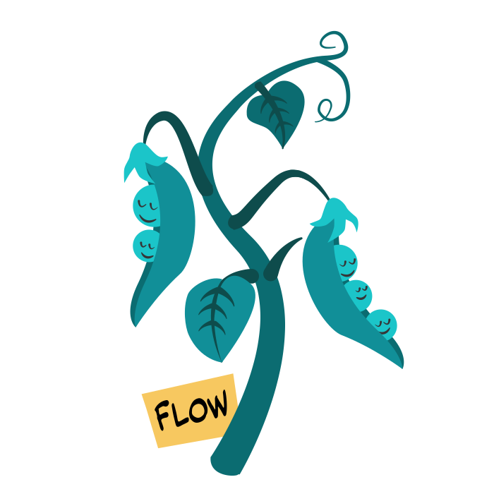
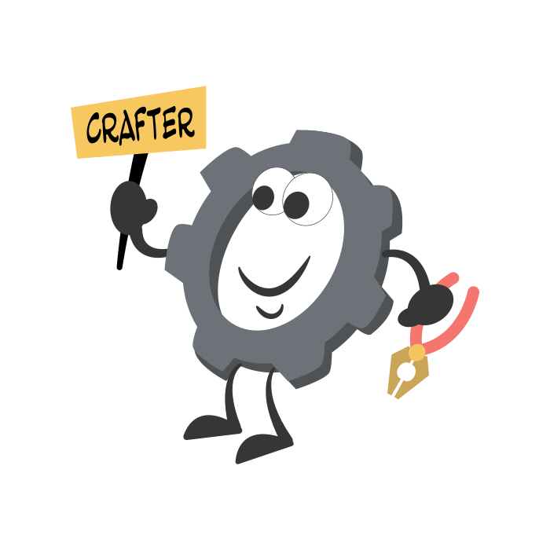
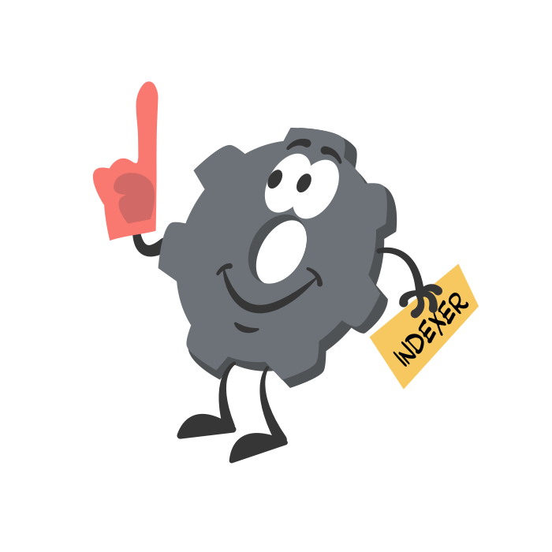
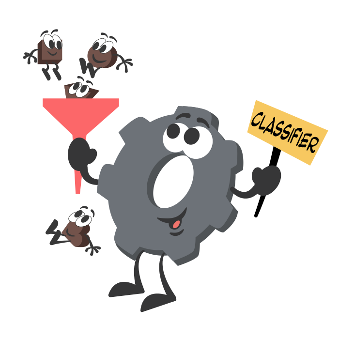
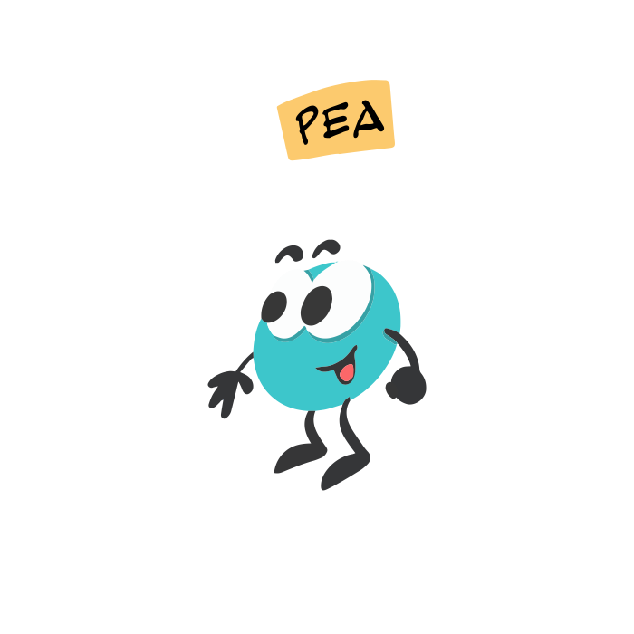

# Jina 101

In Jina 101, you will learn about the basic components of Jina. Before you start, read [the basics of Neural Search](https://jina.ai/2020/07/06/What-is-Neural-Search-and-Why-Should-I-Care.html) to get some context.

<!-- TOC -->

## Document

Documents are pieces of data in any dataset you want to search, and the input queries you use to find what you want. Basically, they are the input and output data for your search workflows.

A good example is the text we type into a search engine like Google. Documents can also be video clips, genetic sequences, MP3 files, scientific papers, funny GIFs, or many other things.

You can think of a Document as a chocolate bar: Different Documents have different formats or ingredients, and you can [break them into smaller chunks](#segmenter).

## Flow

Flows manage the two main search workflows: indexing data (indexing Flow) and then querying it (querying Flow).

A Flow is made up of several sub-tasks, and it manages the states and context of these sub-tasks. The input and output data of Flows are Documents.

## Executor

Executors perform each task in an indexing or querying Flow. Jina offers [many Executors](https://docs.jina.ai/chapters/all_exec.html), which can be divided as follows:

### Crafter

Crafters pre-process input Documents, for example, resizing images or converting text to lower case. A Crafter often comes before the [Encoder](images/#encoder) but it’s not always required.

### Segmenter

Like a [Crafter](images/#crafter), a Segmenter also pre-processes Documents. A Segmenter breaks Documents into **multiple** chunks. For example, breaking a paragraph into sentences.

### Encoder 

Encoders create vector embeddings of Documents, letting users perform semantic search. 

### Indexer

After Documents are [encoded](images/#encoder), an Indexer:

*   **Saves** Documents’ vector embeddings and metadata key-values pairs to storage (during indexing).
*   **Retrieves** the vector embeddings and key-value pairs from storage (during querying).

### Ranker

Rankers sort and rank search results. They are frequently used in a querying Flow. 

### Classifier

Classifiers classify input Documents into categories and output the predicted hard/soft labels. Classifiers are optional, but may be useful depending on the use case.

### Evaluator

Not every search gets perfect results the first time. An Evaluator evaluates performance of other Executors by comparing the Document rankings you **get** with the Document rankings you **want**. Choosing the right set of Executors optimizes your search.

## Pea

A Pea wraps an Executor and lets it exchange data with other Peas. Peas can run locally, remotely, or inside a Docker container, containing all dependencies and context in one place.

Every Pea runs inside a Pod. Sometimes multiple copies of a Pea run in a single Pod to improve efficiency and scaling.

## Pod

A Pod is a container and interface for one or multiple Peas that have the same properties. It coordinates Peas to improve efficiency and scaling. Beyond that, a Pod adds further control, scheduling, and context management to its Peas.

## Driver

A Driver “translates” input and output messages for an Executor. Each Executor requires a different data format to perform its task. Therefore, a Driver interprets incoming messages into Documents and extracts required fields for an Executor. 

## What comes next?

Jina is a happy family. You can feel the harmony when you use Jina.

You can design at the micro-level and scale up to the macro-level. YAML becomes algorithms, Pods become Flows. The patterns and logic always remain the same. This is the beauty of Jina.

Now, continue to [Jina 102](https://docs.jina.ai/chapters/102/index.html) to learn how these components work together! 