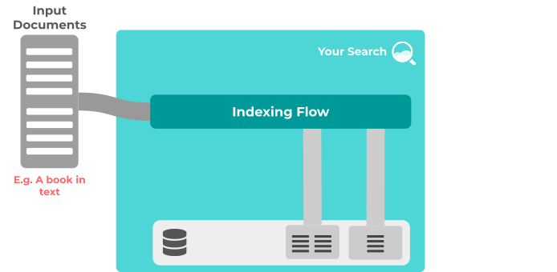
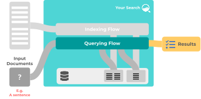
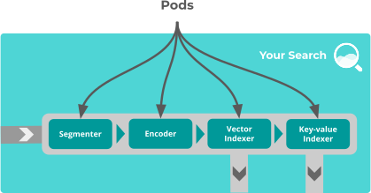
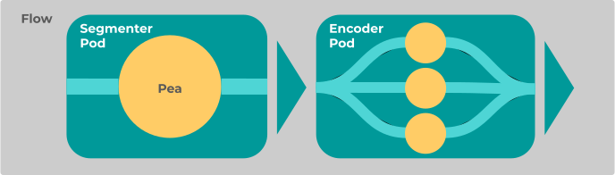
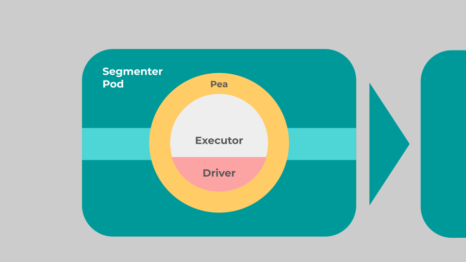
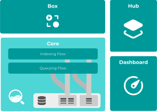

# Jina 102

In Jina 102, you’ll learn how Jina’s basic components work together. Before you start, make sure you’ve already read through [Jina 101](http://101.jina.ai). 

<!-- TOC --> 

## Search workflows

First, we’ll show you how a Flow works in Jina. Be aware, there are many different ways to build a Flow, and this is just one way.

Let’s use a simple text-to-text search application as an example — searching for sentences in a book. We use two Flows for this:

*   An **indexing** Flow makes the whole book searchable by sentence
*   A **querying** Flow handles a user query (in this case, a sentence) and returns search results

A working example can be found [here](https://github.com/jina-ai/examples/tree/master/wikipedia-sentences). (Bear in mind that this example uses pre-processed sentences, so the segmenting step is skipped)

The indexing Flow prepares data to be searched. Input Documents are fed in, processed, and output at the other end as searchable indexes in storage:

Then, the querying Flow takes a user query as its input Document, and returns a list of ranked matches:

### Inside a Flow

Here, we’ll use the indexing Flow as an example:

In our Flow, different Pods perform different tasks. Documents (in this case a book) are:

1. Segmented into chunks (sentences)
2. Transformed into vector embeddings
3. Indexed in key-value pairs
4. Saved to storage

### Inside a Pod

In the Segmenter Pod, there’s only one Pea. But sometimes you group multiple copies of the same Peas in a Pod to increase reliability or [performance](link to sharding section).

### Inside a Pea

Let’s take a closer look at the Pea in the Segmenter Pod:

As you can see, a Pea is a wrapper for an Executor and its Driver. 

While Peas and Pods perform the communication in a Flow, the messages themselves come from the Executors. And each Executor needs a specific Driver to handle its input and output messages.

You can see an example of how Flow, Pods, Peas, Executors, and Drivers work together in our [Wikipedia sentence search example](https://github.com/jina-ai/examples/tree/master/wikipedia-sentences).

## YAML Configuration

From Flows to Executors, every part of Jina is configurable with YAML files. YAML files let you change the behavior of an object without touching its code.

Besides YAML, you can also design Flows in [Jina Dashboard](http://dashboard.jina.ai) or [Python code](link to Flow IO section).

## Search Modality

Our example above shows searching using a single type of data, but what about going further?

### Cross-modal search

An example of cross-modal search is using text to search for images, or the other way around. 

### Multi-modal search

You can use multiple modalities as input for your search applications. For example, a search query input can be an image plus some descriptive text.

To implement cross-modality or multi-modality, visit the [dedicated section](link) in our documentation.

## JinaD

[JinaD]() (Jina Daemon) enables orchestration and management of Jina Flows in distributed search systems through an API endpoint.

## Jina Suite

Jina Suite consists of several different open-source products - Core, Hub, Dashboard and Box.

What you’ve learned in the previous sections are the most important components in Core (Jina Core). But there’s more to explore.

### Core

You construct and manage your search workflows in Core. It consists of distributed microservices (Flows, Peas, Pods, and Executors, etc.) Optionally, you can use JinaD to orchestrate these microservices.

### Hub

[Jina Hub]() for hosting Jina Pods and Apps via container images. You can upload and share images of Pods with other developers in the community.

### Dashboard

[Jina Dashboard]() is a low-code monitoring and management environment for Jina. With Dashboard you can:

*   Build your Flows
*   Monitor log stream
*   Browse Hub images

### Box

[Jina Box]() is a frontend for Jina. It’s a lightweight, customizable omnibox. You can use it to search text, images, videos, audio or any kind of data. 

