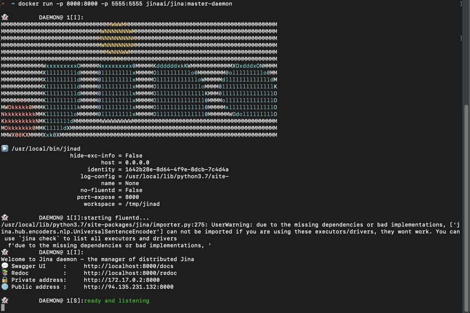
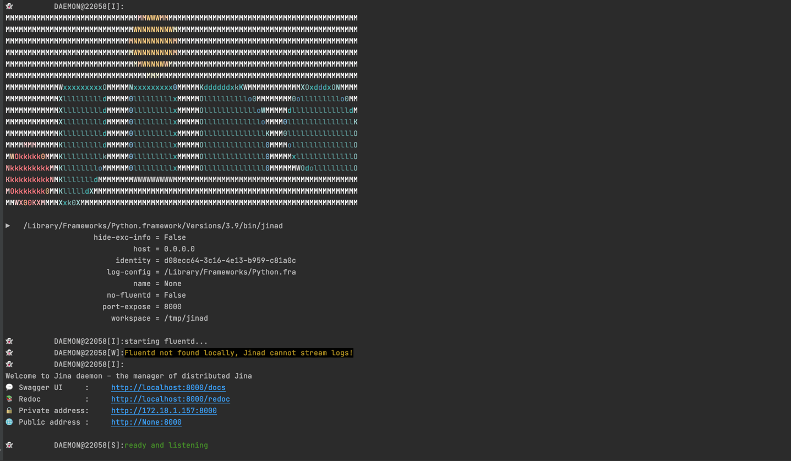
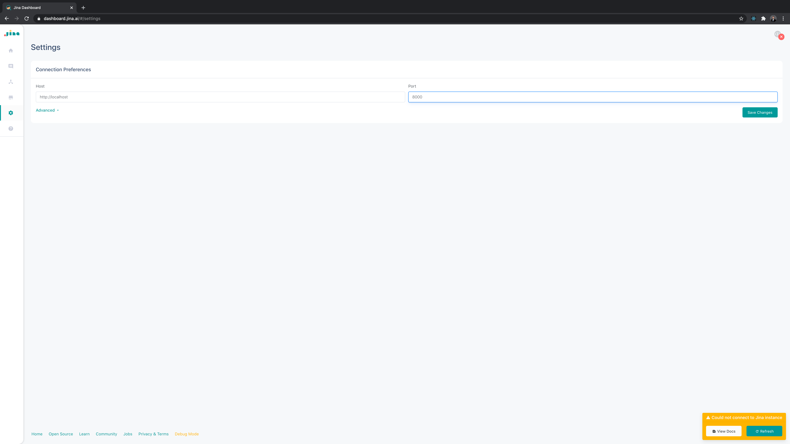
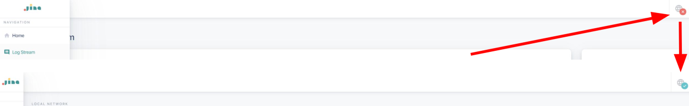

## Connect Dashboard to JinaD

##### Before using the Dashboard with Jina, you'll need to connect it to [JinaD](../remote/jinad.md) first.

### JinaD:

JinaD is a REST + Websockets based server to allow remote workflows in Jina. <br/>
It is built using [FastAPI](https://fastapi.tiangolo.com/)
 and deployed using [Uvicorn](https://www.uvicorn.org/).
For more information check out the [documentation](../remote/jinad.md)

### Before you start

#### Install JinaD with Docker (Recommended)

1. Install [Docker](https://www.docker.com/) and run Docker Desktop
2. Pull the docker image with
 ```bash
docker pull jinaai/jina:master-daemon
```
3. Run the image with
```bash
docker run -p 8000:8000 -p 5555:5555 jinaai/jina:master-daemon
```


#### Install JinaD with Jina CLI

1. [Install JinaD](../remote/jinad.md)
2. Run JinaD with
```bash
jinad
```




### Implementation


1. Go to [Settings](https://dashboard.jina.ai/#/settings)




2. Set **Host** to http://localhost and **Port** to the specified port, which is 8000 in this example. Save changes
3. Click the refresh button int the lower-left corner


The globe icon on the top-left corner should turn into a green check mark, which means the connection was successful.




