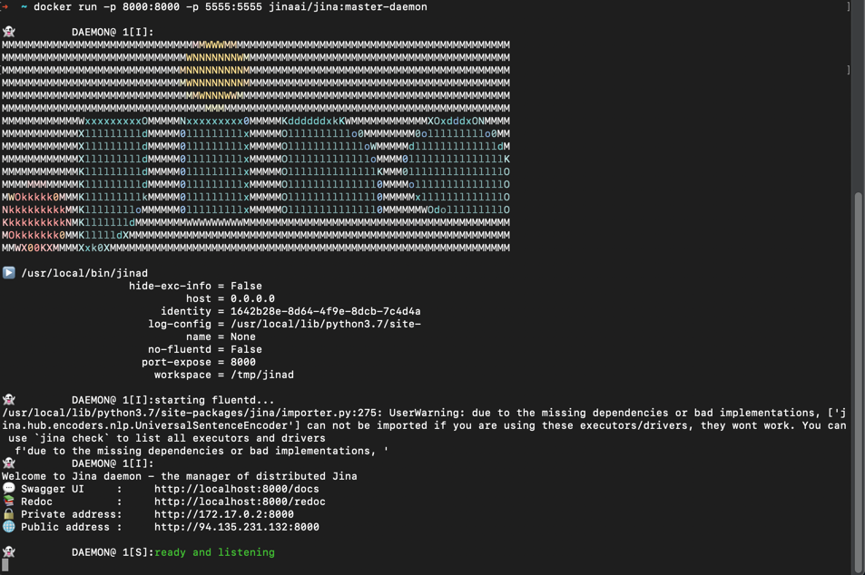
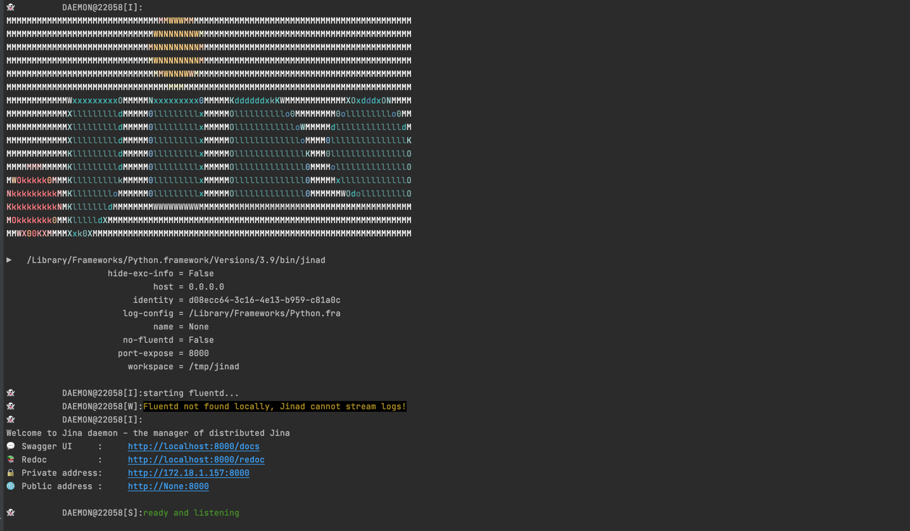

#  Connect Dashboard to JinaD

Before using the Dashboard with Jina, you'll need to connect it to JinaD first. <br/>
Jinad is a REST + Websockets based server to allow remote workflows in Jina. <br/>
It is built using [FastAPI](https://fastapi.tiangolo.com/)
 and deployed using [Uvicorn](https://www.uvicorn.org/).

###Docker (Recommended)

1. Install [Docker](https://www.docker.com/) and run Docker Desktop
2. Pull the docker image with
 ```bash
docker pull jinaai/jina:master-daemon
```
3. Run the image with
```bash
docker run -p 8000:8000 -p 5555:5555 jinaai/jina:master-daemon
```



4. Go to [settings](https://dashboard.jina.ai/#/settings)


   
5. Set **Host** to http://localhost and **Port** to the specified port, which is 8000 in this example. Save changes
6. Click the refresh button int the lower-left corner


The globe icon on the top-left corner should turn into a green check mark, which means the connection was successful.


You should now see the log-streaming and flow visualization.


###Jina CLI

1. [Install JinaD](../remote/jinad.md)
2. Run JinaD with
```bash
jinad
```



3. Follow steps 4. - 6. above
