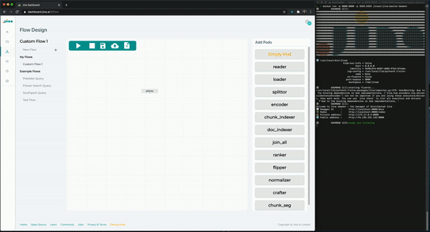
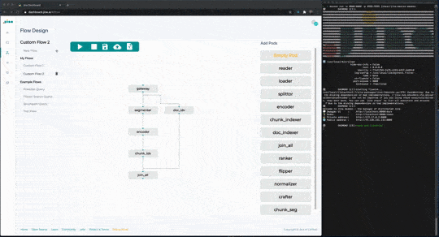

## Flow Design GUI

##### Our GUI is a visual interface that makes composing flows as easy as browsing social media. Design, configure and deploy your flows right from the browser!

### Features

-  Build your own custom Flows per Drag & Drop on the canvas leveraging templates, YAML files or by starting from scratch with empty pods and flows.
-  Deploy your flow with one click directly through JinaD
-  Export your flow as YAML or PNG 

### Before you start

Before you start, you have to [launch JinaD and connect it to the Dashboard](connect-jinaD.md)

### Composing a flow

Drag&Drop the pods to the canvas. You can edit a pod's properties by double clicking it

### Starting and stopping a flow

To start a flow click on the start button in the command bar. To stop it click on the stop button

### Importing a flow

You can import a flow with YAML either in the window for creating a new flow or by clicking at the import flow button in the command bar

### Exporting a flow

You can export a flow either visually as a png or as YAML by clicking the respective buttons in the commandbar

