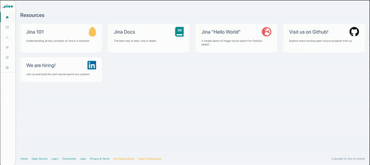

## Jina Hub

##### [Jina Hub](https://dashboard.jina.ai/#/hub) is a centralized registry, where you can share and discover custom and community driven Jina Pods and Apps tailored to specific use cases of neural search.

### Upload and Share Images

[Share your custom Jina Pods ](../hub/publish-your-pod-image.md) by simply uploading a Python file, a Dockerfile and a YAML, and leave the rest of the work to us. Building and version control is automatically handled on the cloud side.

### Cloud Native

As Jina Hub images are containerized, they can be easily leveraged in any Jina Flow, even in distributed environments.

### Open Source

Hub images are made and maintained by the community. You can [contribute to the database of hub images](https://github.com/jina-ai/jina-hub) and help your fellow developers achieve their search goals!

