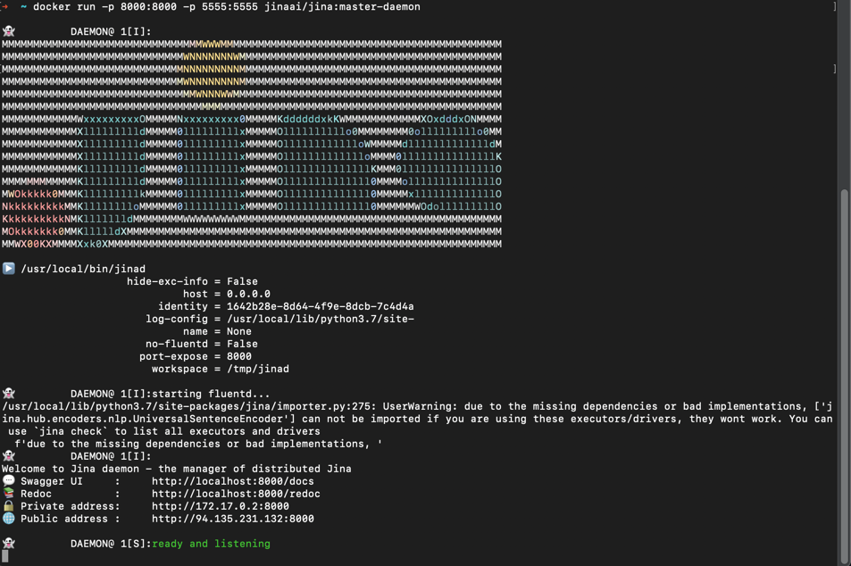
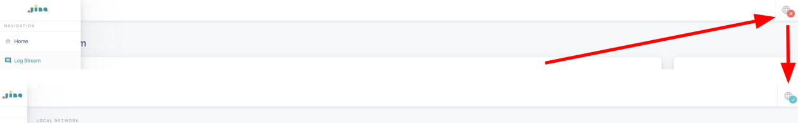
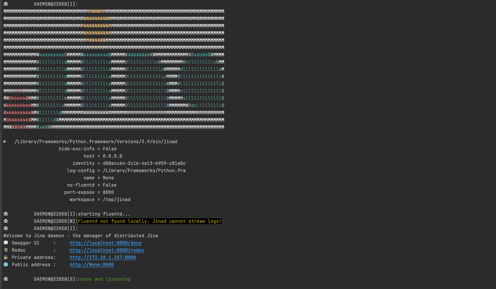

# Jina Dashboard

**Jina Dashboard** is a low-code monitoring and management environment for Jina. With the Dashboard you can build Jina Flows, manage them from a central location and get insights into the health of the Flow through log stream analysis!

Use Jina Dashboard by visiting the [website](https://dashboard.jina.ai) or cloning it from [GitHub](https://github.com/jina-ai/dashboard) 


# Features

-  ##  [Flow Design GUI:](flow.md)
   Build your own custom Flow visually on the canvas leveraging templates, YAML files or by starting from scratch with empty pods and flows. You can add properties as you go, and deploy right from the canvas.

-  ##  [LogStream](log-stream.md)
   Jina’s LogStream enables you to dig deeper into your Jina Flow and debug it by viewing your logs in real-time and filter, group and search based on component (Pod) and log level / message.

-  ##  [Jina Hub](hub.md)
    Share and discover custom and community driven Jina Pods and Apps tailored to specific use cases of neural search.

### In order to use Jina Dashboard it has to be [ connected to JinaD first](connect-jinaD.md)

## How to connect Dashboard to JinaD

Before using the Dashboard with Jina, you'll need to connect it to JinaD first. <br/> 
Jinad is a REST + Websockets based server to allow remote workflows in Jina. <br/> 
It is built using [FastAPI](https://fastapi.tiangolo.com/)
 and deployed using [Uvicorn](https://www.uvicorn.org/). 

###Docker (Recommended)

1. Install [Docker](https://www.docker.com/) and run Docker Desktop
2. Pull the docker image with 
 ```bash
docker pull jinaai/jina:master-daemon
```
3. Run the image with
```bash
docker run -p 8000:8000 -p 5555:5555 jinaai/jina:master-daemon
```



4. Visit https://dashboard.jina.ai/#/settings


   
5. Set **Host** to http://localhost and **Port** to the specified port, which is 8000 in this example. Save changes
6. Click the refresh button int the lower-left corner


The globe icon on the top-left corner should turn into a green check mark, which means the connection was a success.



You should now see the log-streaming and flow visualization. 


###Jina CLI

1. [Install JinaD](../remote/jinad.md)
2. Run JinaD with 
```bash
jinad
```



3. Follow steps 4. - 6. above
