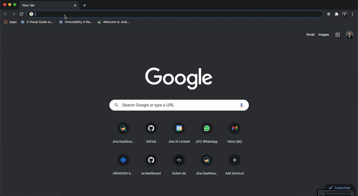

# Jina Dashboard

**Jina Dashboard** is a low-code monitoring and management environment for Jina. With the Dashboard you can build Jina Flows, manage them from a central location and get insights into the health of the Flow through log stream analysis!

Use Jina Dashboard by visiting the [website](https://dashboard.jina.ai) or cloning it from [GitHub](https://github.com/jina-ai/dashboard) 

# Features

-  ##  [Flow Design GUI:](flow.md)
   Build your own custom Flow visually on the canvas leveraging templates, YAML files or by starting from scratch with empty pods and flows. You can add properties as you go, and deploy right from the canvas.

-  ##  [LogStream](log-stream.md)
   Jina’s LogStream enables you to dig deeper into your Jina Flow and debug it by viewing your logs in real-time and filter, group and search based on component (Pod) and log level / message.

-  ##  [Jina Hub](hub.md)
    Share and discover custom and community driven Jina Pods and Apps tailored to specific use cases of neural search.

### In order to use Jina Dashboard it has to be [ connected to JinaD first](connect-jinaD.md)
