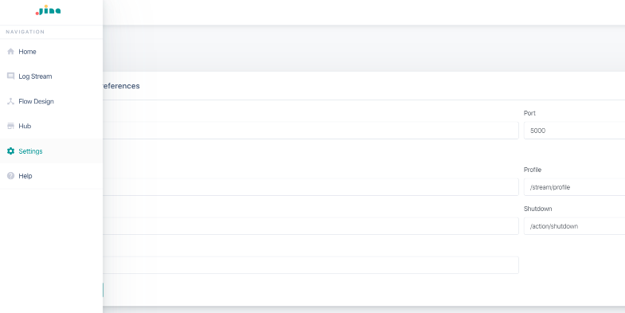

# Jina Dashboard

**Jina Dashboard** is a visual interface to facilitate Development with Jina.

In order do use the Dashboard visit https://dashboard.jina.ai


# Features

-  ##  [Monitoring of logs](log-stream.md)
-  ##  [Design and start Flows with Drag & Drop](flow.md)
-  ##  [Browse Hub images ](hub.md)
-  ##  [Import/Export Flows](flow.md)


## How to connect Dashboard to Jina

CHANGE THIS IN THE NEXT PR

Go to: [https://dashboard.jina.ai/](https://dashboard.jina.ai/)

Click on the globe icon on the top-left corner to connect to the log server.

It should turn into a green check mark, which means the connection is success.


You should now see the log-streaming and flow visualization. 

If it has a red cross, it means the connection is lost or the endpoint is not set correctly. Please move to the next step for instruction.

## Customize the endpoints

By default the configurations of the log server is as follows:

```yaml
host: 0.0.0.0
port: 5000
endpoints:
  log: /stream/log  # fetching log in SSE stream
  profile: /stream/profile  # fetching profiling log in SSE stream
  yaml: /data/yaml  # get the YAML spec of a flow
  shutdown: /action/shutdown  # shutdown the log server
  ready: /status/ready  # tell if the log server is ready, return 200 if yes
```

You can customize the endpoints of the log server via a YAML, say `mylogserver.yml`. Then pass it to the Flow API via 


<table>
<tr>
<td> If you use Flow API in Python, </td>
<td>

```python
f = Flow(logserver=True, logserver_config='mylogserver.yml')
```

</td>
</tr>
<tr>
<td> ...or write a Flow from YAML </td>
<td>

```yaml
!Flow
with:
  logserver: true
  logserver_config: mylogserver.yml 
```

</td>
</tr>

<tr>
<td>...or start a Flow from CLI</td>
<td>

```bash
jina flow --logserver --logserver-config mylogserver.yml ...
```


</td>
</tr>
</table>


Don't forget to update endpoint in the dashboard accordingly.


