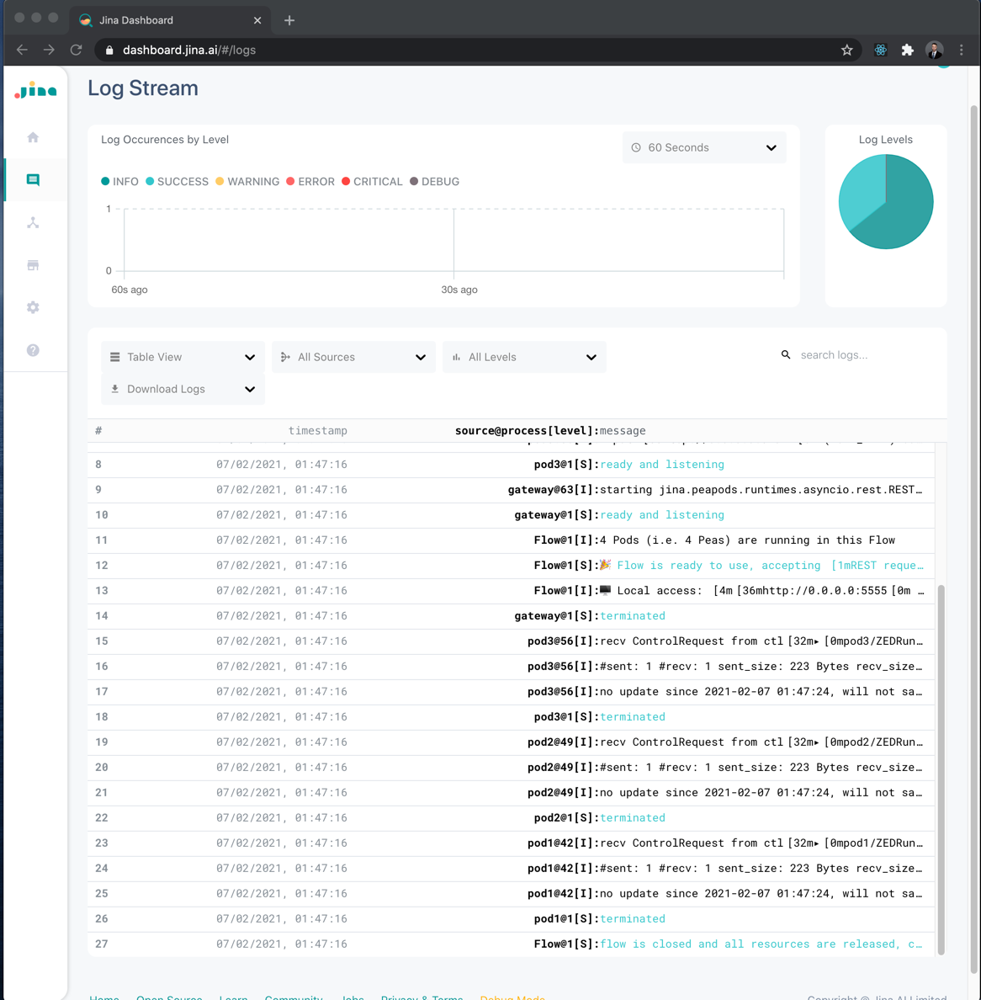
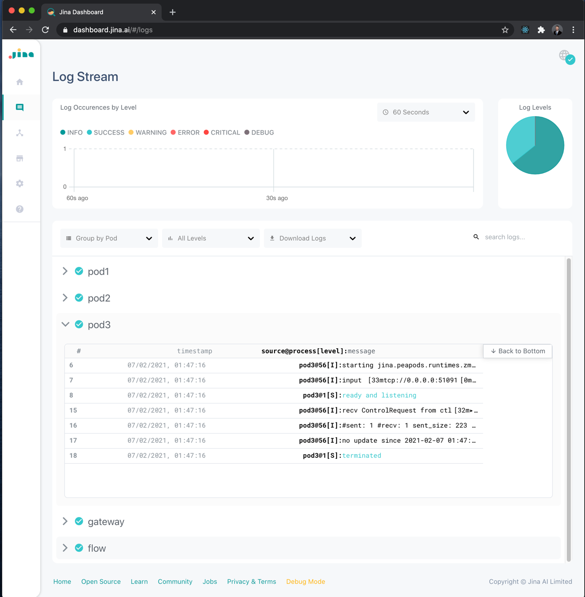
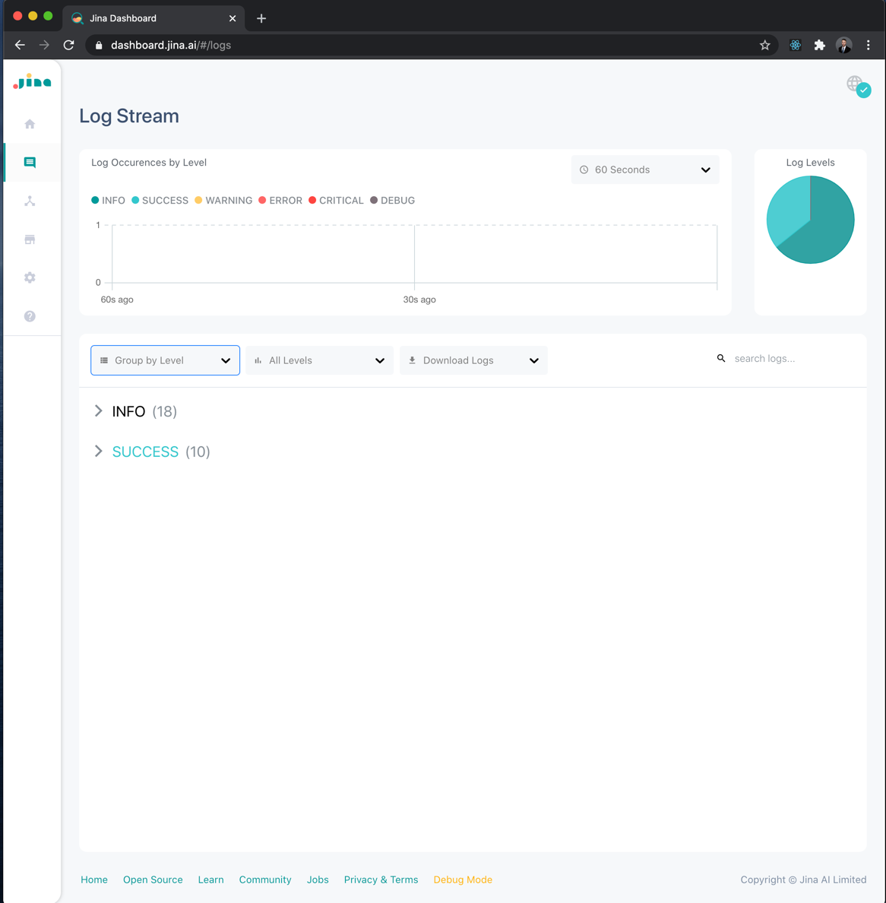

## LogStream

##### Jina’s LogStream lets you monitor and debug your flows easily. You can audit your running flow live and  filter, group and search based on component (Pod) or log level / message.

### Table View:

In Table View you can check out all your logs in chronological order

### Group by Pod:

You can also group your logs by the component that produced them

### Group by Level:

And you can group your logs by level like Info, Success, Warning, Error, Critical and Debug

### Before you start

In order to see logs, you need to be connected to [JinaD](connect-to-jinaD.md) and [running a flow](flow.md)