==========================================
A guide on Jina Flow Evaluation Mode
==========================================

.. meta::
   :description: A guide on Jina Flow Evaluation Mode
   :keywords: Jina, flow evaluation

.. note:: This guide assumes you have a basic understanding of Jina, if you haven't, please check out `Jina 101 <https://docs.jina.ai/chapters/101/index.html>`_ first.

.. contents:: Table of Contents
    :depth: 2

Motivation
--------------------

As a :term:`Neural Search` system,
Jina employs deep neural networks to find the best :term:`Match` based on the user query.
Measuring system performance is critical important for Jina.

Users generally place an emphasis on evaluating final document ranking result using information retrieval metrics,
such as Precision, Recall, mAP or nDCG.
However, it ignores the fact that a search system is often composed by multiple components,
whereas evaluation on the final results hardly reveal useful insights about the system.
It is not straightforward to see the problematic component.

Jina organize such components in a :term:`Flow`.
For this reason, we expect Jina evaluator has the capability to work anywhere in the workflow,
at the :term:`Pod` level.

Before you start
-------------------

We expect you have a clean Python 3.7/3.8/3.9 (virtual) build.
With Jina installed on your machine:

.. highlight:: bash
.. code-block:: bash

    pip install -U jina

Overview
-----------------

To achieve our objective, we designed a family of :term:`Executor` named :term:`Evaluator`.
These evaluators evaluate messages coming from any kind of executor.
As a new type of :term:`Pod`, evaluators inspect documents from the request and comparing them with ground truth.

The evaluation, in general, follows a two step approach: *diff extraction* and *quantization*.
Jina :term:`Driver` extracts diff information from :term:`Protobuf`,
and pass diff information to executor.
The second steps happens inside the executor: quantize the diffed object to a number.

Jina evaluators can be categorised into **ranking evaluators**, **text evaluators** and **embedding evaluators**.

.. list-table:: Jina Evaluator Types
   :widths: 25 25 50
   :header-rows: 1

   * - Name
     - Example
     - Description
   * - Ranking evaluators
     - Precision, Recall, F1, aP, nDCG, mRR
     - Evaluate messages coming out from Indexers and Rankers and compares matches with groundtruths
   * - Text evaluators
     - Length, Bleu, Edit Distance, Gleu, Hamming Distance, Jaccard Distance
     - Evaluates the difference between actual and desired text
   * - Embedding evaluators
     - Cosine Distance, Euclidean Distance, L1 Norm, Minkowski Distance
     - Evaluates the difference between actual and desired embeddings

Evaluation in Action
----------------------

Evaluation works in parallel with ``IndexRequest`` and ``SearchRequest``.
The new :term:`Flow` API :meth:`inspect` allow users to add evaluation pod at an arbitrary place in the flow.
For example:

.. highlight:: python
.. code-block:: python

    from jina import Flow

    f = Flow(inspect='HANG').add(
        uses='!BaseCrafter', name='crafter').add(
        uses='!BaseEncoder', name='encoder').inspect(
        uses='!BaseEmbeddingEvaluator', name='embed_eval').add(
        uses='!CompoundIndexer', name='indexer').add(
        uses='!BaseRanker', name='ranker').inspect(
        uses='!BaseRankingEvaluator', name='rank_eval')

The above example illustrates how we add evaluator into a flow.
We added two evaluators: a ``BaseEmbeddingEvaluator`` after encoder and a ``BaseRankingEvaluator`` after ``BaseRanker``.

ADD SOME TEXT ON FLOW INSPECT STRATEGY

One highlight of the :meth:`inspect` is that it does not introduce any side-effect to the flow:

1. The evaluations are running as *side task* in parallel.
They deviate from the main task and are not required to complete the request. Thus, it won’t slow down the flow on the main task.
2. Attaching an inspect Pod to the flow does not change the socket type between the original Pod and its neighbours.
3. All inspect Pods can be removed from the Flow by setting ``Flow(inspect='REMOVE')``.

You might noticed that we defined ``Flow(inspect='HANG')`` in the above code example as inspect type.
The :class:`FlowInspectType` has three types: ``HANG``, ``COLLECT`` and ``REMOVE``.

``Flow(inspect='HANG')``

``Flow(inspect='COLLECT')``

``Flow(inspect='REMOVE')``

Conclusion
-----------------

In this guide, we introduced why we need Jina evaluators,
how we organize Jina evaluators.
Apart from that, we gave some concrete examples of how to use Jina evaluators.
We hope now you have a better understanding of Jina evaluators.

What's next
-----------------

Thanks for your time & effort while reading this guide!
If you still have questions, feel free to `submit an issue <https://github.com/jina-ai/jina/issues>`_ or post a message in our `community slack channel <https://docs.jina.ai/chapters/CONTRIBUTING.html#join-us-on-slack>`_ .

To gain a deeper knowledge on the implementation of Jina evaluator, you can find the source code `here <https://github.com/jina-ai/jina/tree/master/jina/executors/evaluators>`_.