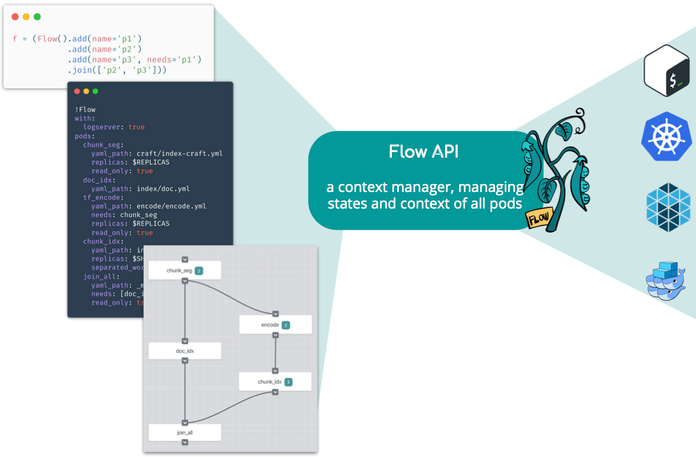

## Using the Flow API to Compose Your Jina Workflow

In this section, you will get to know how to construct the flow using different approaches.

Table of Contents
- [Using Flow API to Compose Your Jina Workflow](#using-flow-api-to-compose-your-jina-workflow)
  * [Feature description and expected outcome](#feature-description-and-expected-outcome)
  * [Before you start](#before-you-start)
  * [Implementation](#implementation)
    + [Use Flow API in Python](#use-flow-api-in-python)
      - [Create a Flow](#create-a-flow)
      - [Add Pod into the Flow](#add-pod-into-the-flow)
      - [Add a Containerized Pod into the Flow](#add-a-containerized-pod-into-the-flow)
      - [Add a Remote Pod into the Flow](#add-a-remote-pod-into-the-flow)
      - [Add a Remote Containerized Pod into the Flow](#add-a-remote-containerized-pod-into-the-flow)
      - [Parallelize the Steps](#parallelize-the-steps)
      - [Waiting for Parallel Steps to Finish](#waiting-for-parallel-steps-to-finish)
      - [Run a Flow](#run-a-flow)
      - [Test Connectivity with Dry Run](#test-connectivity-with-dry-run)
      - [Iterate over Pods in the Flow](#iterate-over-pods-in-the-flow)
      - [Feed Data to the Flow](#feed-data-to-the-flow)
      - [Feed Data to the Flow from Other Clients](#feed-data-to-the-flow-from-other-clients)
    + [Use Flow API in YAML](#use-flow-api-in-yaml)
      - [Load a Flow from YAML](#load-a-flow-from-yaml)
    + [Design a Flow with Dashboard](#design-a-flow-with-dashboard)

### Feature description and expected outcome
In search systems, tasks such as indexing often involve multiple steps: preprocessing, encoding, storing, etc. In Jina's architecture, each step is implemented by an Executor and wrapped by a Pod. This microservice design makes the whole pipeline flexible and scalable. Accomplishing a task is then linking all these Pods to work together, either sequentially or in parallel; locally or remotely.

The Flow API is a context manager for Pods. Each `Flow` object corresponds to a real-world task. It helps the user to manage the states and contexts of all Pods required in that task. The Flow API translates a workflow defined in Python code, YAML file, or interactive graph to a runtime backed by multi-thread/process, Kubernetes, Docker Swarm, etc. Users don't need to worry about where the Pod is running or how the Pods are connected.



### Before you start
Make sure you install latest version of Jina via [Installation](https://docs.jina.ai/chapters/install/os/index.html).

### Implementation

#### Use Flow API in Python

##### Create a Flow

To create a new Flow:

```python
from jina.flow import Flow

f = Flow()
```

`Flow()` accepts some arguments. See `jina flow --help` or check [here](https://docs.jina.ai/chapters/cli/jina-flow.html) for details.

When the arguments given to `Flow()` cannot be parsed, they are propagated to all the Flow's `Pods` for parsing (if they are accepted, see `jina pod --help` for the list of arguments). For example:

```python
f = Flow(read_only=True)
```

will set the `read_only` attribute of all Pods in `f` to `True`.

##### Add Pod into the Flow

To add a Pod to the Flow, simply call `.add()`, syntax of YAML file can be found [here](https://docs.jina.ai/chapters/yaml/index.html):

```python
f = (Flow().add(name='p1', uses='mypod1.yml')
           .add(name='p2', uses='mypod2.yml', timeout_ready=50000)
           .add(name='p3', uses='mypod3.yml', read_only=True))
```

This will create a sequential workflow:

```

gateway -> p1 -> p2 -> p3 -> gateway

```

The input of each Pod is the output of the last Pod in sequential order. The gateway is the entrypoint of the whole Jina network. The `gateway` Pod is automatically added to every `Flow`, of which the output is the first Pod and the input is the last Pod defined in the Flow.

All accepted arguments follow the command line interface of `Pod`, which can be found in `jina pod --help`. Just remember to replace the dash `-` to underscore `_` in the name of the argument when referring to it in Python.

Besides the file path, in Flow API `uses` can accept other types:

| Type | Example | Remark |
| --- | --- | --- |
| YAML file path | `crafter/my.yml` | |
| Inline YAML | `- !Buffer2URI | {mimetype: png}` | Don't forget `- !` in the beginning |
| The name of an executor [listed here](../all_exec.html) | `NumpyIndexer` | Only the executors that have full default values can be directly used |
| Built-in simple executors [listed here](../simple_exec.html) | `_clear` | Always starts with `_` |
| Docker image | `docker://jinahub/pod.encoder.dummy_mwu_encoder:0.0.6-1.0.2` | Add `docker://` before the image name and set timeout_ready to -1 to avoid timeout error |

##### Add a Remote Pod into the Flow

To run a Pod remotely, simply specify the `host` and `port_expose` arguments. For example:

```python
f = (Flow().add(name='p1')
           .add(name='p2', host='192.168.0.100', port_expose=53100)
           .add(name='p3'))
```

This will start `p2` remotely on `192.168.0.100`, whereas `p1` and `p3` run locally.

To use remote Pods, you need to start a `gateway` on `192.168.0.100` in advance. More information on using remote Pods can be found [here](https://docs.jina.ai/chapters/remote/index.html).  


##### Add a Remote Containerized Pod into the Flow

A very useful pattern is to combine the above two features together:

```python

f = (Flow().add(name='p1')
           .add(name='p2', host='192.168.0.100', port_expose=53100,
                uses='docker://jinahub/pod.encoder.dummy_mwu_encoder:0.0.6-1.0.2')
           .add(name='p3'))
```

This will start `p2` remotely on `192.168.0.100` running a Docker container equipped with the image `jinaai/hub.executors.encoders.bidaf:latest`. Of course Docker is required on `192.168.0.100`. More information on using remote Pods can be found [here](https://docs.jina.ai/chapters/remote/index.html).


##### Parallelize the Steps

By default, if you keep adding `.add()` to a `Flow`, it will create a sequential workflow chain. You can parallelize some of the steps by using `needs` argument. For example,

```python
f = (Flow().add(name='p1')
           .add(name='p2')
           .add(name='p3', needs='p1'))
```

This creates a workflow, where `p2` and `p3` work in parallel with the output of `p1`.
```
gateway -> p1 -> p2
            |
              -> p3 -> gateway
```

##### Waiting for Parallel Steps to Finish

In the prior example, the message is returned to the gateway regardless of the status of `p2`. To wait for multiple parallel steps to finish before continuing, you can do:

```python
f = (Flow().add(name='p1')
           .add(name='p2')
           .add(name='p3', needs='p1')
           .join(['p2', 'p3']))
```

which gives

```
gateway -> p1 -> p2 ->
            |          | -> wait until both done -> gateway
              -> p3 ->
```


##### Run a Flow

To run a Flow, simply use the `with` keyword:

```python

f = (Flow().add(name='p1')
           .add(name='p2')
           .add(name='p3', needs='p1')
           .join(['p2', 'p3']))

with f:
    # the flow is now running

```

Though you can manually call the `start()` method to run the flow, you also need to call the corresponding `close()` method to release the resource. Using `with` saves you the trouble, as the resource is automatically released when running out of the scope.

##### Test Connectivity with Dry Run

You can test the whole workflow with `pass`. For example:

```python

with f:
    pass

```

##### Iterate over Pods in the Flow

You can iterate the Pods in a Flow like you would a list. For example:

```python

f = (Flow().add(name='p1')
           .add(name='p2')
           .add(name='p3', needs='p1')
           .join(['p2', 'p3']))

for p in f.build():
    print(f'name: {p[0]} in: {str(p[1].args.socket_in)} out: {str(p[1].args.socket_out)}')

```
Note f.build() will build the underlying network context but not run the Pods. It is very useful for debugging.

##### Feed Data to the Flow

You can use `.index()`, `.search()` to feed index data and search query to a Flow:

```python
with f:
    f.index(input_fn)
```

```python
with f:
    f.search(input_fn, top_k=50, on_done=print)
```

- `input_fn` is an `Iterator[bytes]`, each of which corresponds to the representation of a Document with bytes.
- `on_done` is the callback function after each request, and takes a `Request` protobuf as its only input.

A simple `input_fn` is defined as follows:

```python
def input_fn():
    for _ in range(10):
        yield b's'


# or ...
input_fn = (b's' for _ in range(10))
```

> Please note that the current Flow API does not support using `index()` and `search()` together in the same `with` scope. This is because the workflow of `index()` and `search()` are usually different, and you cannot use one workflow for both tasks.

##### Feed Data to the Flow from Other Clients

If you don't use Python as a client, or your client and Flow are in different instances, you can keep a Flow running and use a client in another language to connect to it:

```python
import threading

with f:
    f.block()
```

**WARNING**: don't use a while loop to do the waiting, it is extremely inefficient:

```python
with f:
    while True: # <- dont do that
        pass # <- dont do that
```

#### Use Flow API in YAML

You can also write a Flow in YAML:

```yaml
jtype: Flow
version: '1.0'
with:
    restful: true
pods:
  - name: pod0  # notice the change here, name is now an attribute
    method: add  # by default method is always add, available: add, needs, inspect
    uses: _pass
    needs: gateway
  - name: pod1  # notice the change here, name is now an attribute
    method: add  # by default method is always add, available: add, needs, inspect
    uses: _pass
    needs: gateway
  - method: inspect  # add an inspect node on pod1
  - method: needs  # let's try something new in Flow YAML v1: needs
    needs: [pod1, pod0]
```

You can use enviroment variables with `$` in YAML. More information on the Flow YAML Schema can be found [here](https://docs.jina.ai/chapters/yaml/index.html).

#### Add a Driver in YAML

`Executors` are equipped with default `Drivers` if no `Drivers` defined. If you want to add other `Drivers` for `Executors`, you need to define your customized YAML file for the Executor and uses it in the Flow YAML file. You can find more information about the YAML configuration [here](https://docs.jina.ai/chapters/yaml/index.html).
The following example shows how to add drivers in a compound executor.

```yaml
jtype: CompoundIndexer
components:
  - jtype: NumpyIndexer
    with:
      index_filename: vec.gz
      metric: cosine
    metas:
      name: vecidx  # a customized name
  - jtype: BinaryPbIndexer
    with:
      index_filename: doc.gz
    metas:
      name: docidx  # a customized name
metas:
  name: indexer
  workspace: $JINA_WORKSPACE
requests:
  on:
    SearchRequest:
      - jtype: VectorSearchDriver  # Search Driver for NumpyIndexer
        with:
          executor: vecidx
      - jtype: KVSearchDriver  # Search Driver for BinaryPbIndexer
        with:
          executor: docidx
          is_update: True
          traversal_paths: ['m']
    [IndexRequest, UpdateRequest]:
      - jtype: VectorIndexDriver  # Index Driver for NumpyIndexer
        with:
          executor: vecidx
      - jtype: KVIndexDriver  # Index Driver for BinaryPbIndexer
        with:
          executor: docidx
```

##### Load a Flow from YAML

```python
from jina.flow import Flow
f = Flow.load_config('myflow.yml')
```


#### Design a Flow with Dashboard

With Jina Dashboard, you can interactively drag and drop Pods, set their attribute and export to a Flow YAML file.

More information on the dashboard can be found [here](https://github.com/jina-ai/dashboard).
