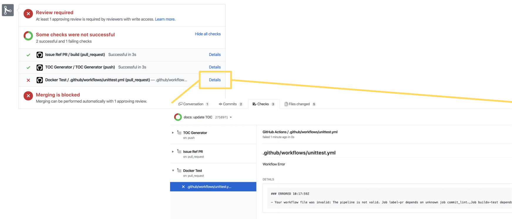

# Publish Your Pod Image to Jina Hub

You can publish your custom executor pod to `jina` hub by simply contributing your pod files to the `jina` repository. This can be done by raising a PR with all the relevant pod files bundled as described below. Jina's CI/CD pipeline will automatically use the PR to build an image and publish it to Jina Hub.

## What Files Need to be Uploaded?

Typically, the following files are required:

| File             | Descriptions                                                                                        |
|------------------|-----------------------------------------------------------------------------------------------------|
| `Dockerfile`     | describes the dependency setup and exposes the entry point                                          |
| `manifest.yml`   | metadata info like image, author, tags, etc. helps the Hub to index and classify the image          |
| `README.md`      | an instruction guide describing the image usage                                                     | 
| `*.py`           | describes the executor logic written in Python, if applicable                                       |
| `*.yml`          | a YAML file describes the executor arguments and configs, if you want users to use your config      |

Note, large binary files (such as pretrained model, auxiliary data) are **not** recommended to upload to this repository. You can use `RUN wget ...` or `RUN curl` inside the `Dockerfile` to download it from the web during the build.


Your file bundle `awesomeness` should be uploaded to:
```text
hub/
  |
   - executors/
       |
        - encoders/
            |
            - awesomeness/
                |
                |- Dockerfile
                |- manifest.yml
                |- README.md
                |- awesome_ai.py
```

Your image will be published as `jinaai/hub.executors.encoders.awesomeness`.

## Schema of `manifest.yml`

`manifest.yml` must exist if you want to publish your Pod image to Jina Hub.

`manifest.yml` annotates your image so that it can be managed by Jina Hub. To ensure better compatibility with Jina Hub, you should carefully set `manifest.yml` to use correct values.

| Key | Description | Default |
| --- | --- | --- |
| `name` | Human-readable title of the image (must match with `^[a-zA-Z_$][a-zA-Z_\s\-$0-9]{3,20}$`) | Required |
| `description` | Human-readable description of the software packaged in the image | Required |
| `author` | contact details of the people or organization responsible for the image (string) | `Jina AI Dev-Team (dev-team@jina.ai)` |
| `url` | URL to find more information on the image (string) | `https://jina.ai` |
| `documentation` | URL to get documentation on the image (string) | `https://docs.jina.ai` |
| `version` | version of the image, it should be [Semantic versioning-compatible](http://semver.org/) | `0.0.0` |
| `vendor` | the name of the distributing entity, organization or individual (string) | `Jina AI Limited` |
| `license` | license under which contained software is distributed, it should be [in this list](https://github.com/jina-ai/jina/blob/master/jina/resources/hub-builder/osi-approved.yml) | `apache-2.0` |
| `avatar` | a picture that personalizes and distinguishes your image | None |
| `platform` | a list of CPU architectures that your image is built on, each item should be [in this list](https://github.com/jina-ai/jina/blob/master/jina/resources/hub-builder/platforms.yml) | `[linux/amd64]` | 

Please refer to [hub/examples/mwu_encoder/manifest.yml](hub/examples/mwu_encoder/manifest.yml) for the example.

## Steps to Publish Your Image

All you need is to publish your file bundle into this repo. Subsequently, the Docker image building, uploading and tagging are all handled automatically by our CICD pipeline. 

1. Let's say your organize [all files mentioned in here](#what-files-need-to-be-uploaded) in a folder called `awesomeness`. Depending on what you are contributing, you can put it into `hub/executors/indexers/awesomeness`.
2. Make a Pull Request and commit your changes into this repository, remember to follow the commit lint style.
3. Wait until the CICD finish and you get at least one reviewer's approval.
4. Merge it! 

The CICD pipeline will work on building, uploading and tagging the image on the Jina Hub.

The image will be available at `jinaai/hub.executors.indexers.awesomeness:0.0.0` assuming your version number is defined as `0.0.0` in `manifest.yml`.

You can use the image with [the ways described here](./use-your-pod.html#use-your-pod-image).  


## Why My Upload Fails on the CICD?

Common causes why your pod upload could fail:

- [ ] Required file `Dockerfile`, `manifest.yml`, `README.md` is missing. 
- [ ] The required field in `manifest.yml` is missing.
- [ ] Some field value is not in the correct format, not passing the sanity check.
- [ ] The pod bundle is badly placed.
- [ ] The build is success but it fails on [three basic usage tests](./use-your-pod.html#use-your-pod-image).

Click "Details" and check out the log of the CICD pipeline:


