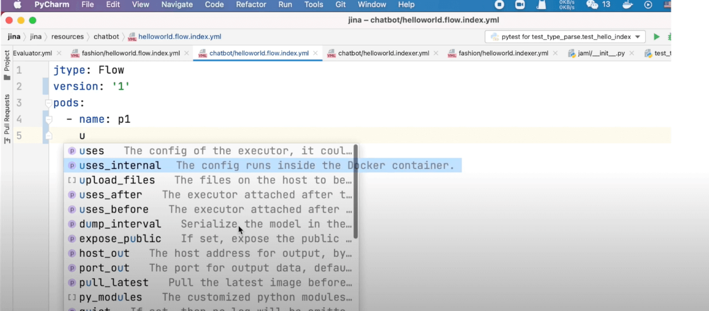

# Speed-up Jina app development in PyCharm and VSCode

Jina app development can be time consuming if you do not have the IDE setup correctly. This chapter describes how to speed up your developer experience
in PyCharm and VSCode IDE while using Jina. In particular we focus on how to enable Intellisense for Jina YAML configuration files. Intellisense can provide code completion, showing number and arguments list, validating your YAML config.

These features can help you build your Jina application much faster.

## Set up your developer environment for Jina

Once you have the latest Jina version installed with PyPI, you can begin to create your Jina application. Two types of files need to be written: Python code and YAML configuration files. The Python file defines the entry point and customized logic while the YAML configuration files define the flow composition and the configuration of each individual Executor. Depending on the cases and the depth of customization, you can develop the project in both ways. In Jina, it is even possible to build a completely code free project that only depends on the configuration. Most IDEs have provided smart intelligence for Python development - due to
straightforward API type hints and 100% string coverage in Jina framework, you can enjoy a pretty smooth development experience. However, for YAML configuration files, it doesn't help so much besides simple code highlight which could slow down your development speed as you have to navigate through the documentation of the code base in order to figure out which component
or argument you really want to use.

## Enable Intellisense for Jina YAML configuration files in PyCharm:

1. First open PyCharm, click on the Menu and select Preference. 
2. In the left panel, search for JSON schema in the search box and select JSON schema mappings.
3. Next, in the right panel click + icon and add a new Schema.
4. Name: Name as per choice (for eg. jina) 
5. In the Schema file or URL write `api.jina.ai/schemas/latest.json` ( this ensures that your schema is always up to date with the new release).
6. You can also bind it to the specific Jina version or pre-release version.
7. In the Schema Version, select JSON Schema version 7.
8. Finally, add to File path pattern mapping: *.jaml to associate any files that end with JAML or Jina YAML extensions to the schema.
9. Click OK to apply the change.


## For Visual Studio Code developers:

1. First install the YAML extension from the RedHat.
2. Click on the sidebar and select Extension.
3. Search for YAML and then select *YAML support* from RedHat and then install it.
4. Open your IDE-wise `settings.json`, create a new entry:
```
“yaml.schemas”: {
“https://api.jina.ai/schemas/latest.json”: [“/*.jina.yml, /*.jaml]
}
```
- Finally save your `settings.json` to apply the change.




## Using the VSCode and PyCharm extensions

- Step 1:
Create a new `hello.jina.yml` file and the IDE successfully marks it as Jina file type.
If it doesn't, you may want to manually select the schema you just created.

- Step 2:
Now type Jtype in the first line and you will see the IDE suggests you with flow or a list of Executors that Jina contains.


*jtype* is a synonym for the bond mark. We recommend you to use `jtype` over the bond mark as
it gives a cross-platform compatible yaml files.
Now, the IDE immediately marks it as yellow as it is not a valid Jina config file.

- Step 3:
Hover your mouse on it and it complains you haven't defined the required field version and parts.
It let's it complete them as you write urlc's autocomplete kicks in to help you fill in the default
values.

- Step 4:
You can hover your mouse on the field to see the help text, which is consistent with the
documentation. You will also see the hint is based on the context: for example, when writing parts, it
suggests all arguments that are accepted by the part.

- Step 5:
When you write something that is unrecognizable by the schema, the ID will mark it as yellow
immediately. Intellisense becomes super helpful when you write an Executor level YAML
file.

- Step 6:
Let's create a new YAML file for configuring Numpy indexer.
You can see the IDE will only keep the arguments that are accepted by that Executor.
It also works on the nested level when you define request and it shows only drivers
and when you define the drivers it shows relevant arguments that are accepted by
that driver.


- Step 7:
You can check out the log stream for any driver or Executor by holding your mouse on it besides
PyCharm or VSCode. Most mainstream IDEs also support JSON schema. You can configure it manually, the actual user experience may slightly vary depending on your IDE or plugin in general. 

## Conclusion
A schema file enables code completion, syntax validation and argument filtering, filling default values and displaying help text.
Check out the [video link to the IDE setup tutorial](https://youtu.be/qOD-6mihUzQ).


