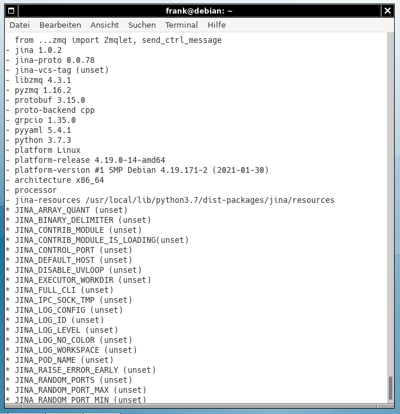

# Check The Installation

After you have installed Jina Core, it is advisable to carry out a short check. This will verify that everything has gone smoothly. On the command line, run the following command:

```bash
jina -vf
```

The option `-vf` (long version: `--version-full`) shows Jina and all the dependencies' versions. The output contains a list of Python packages followed by the names of variables that are in use. The figure below shows you how the output looks like.


