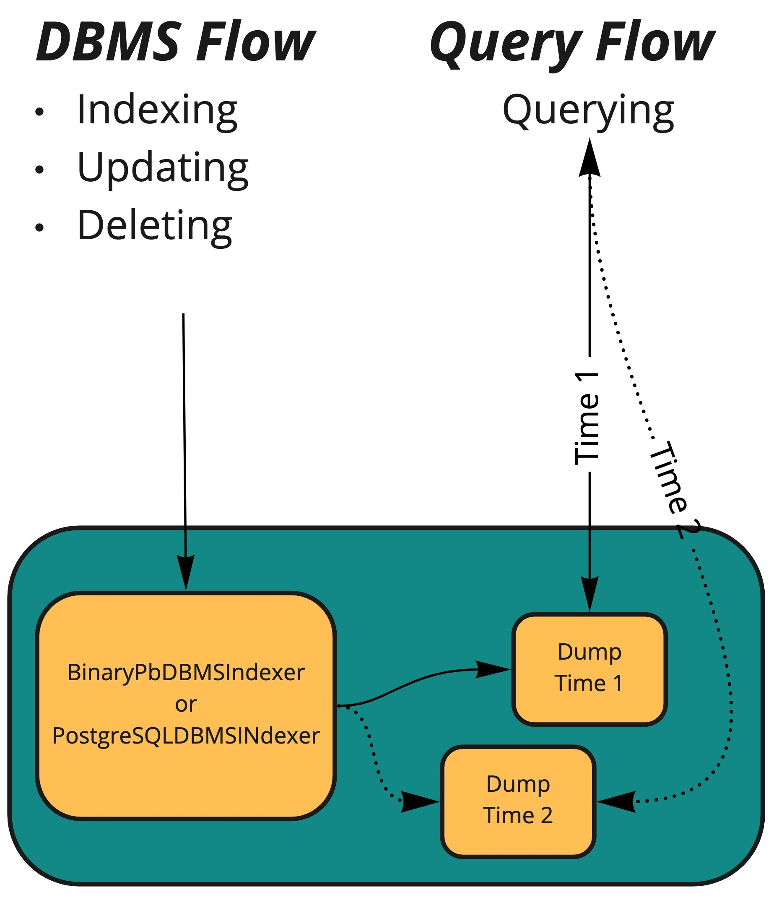

Parallelization
===============

Learn how Jina handles parallelization of data processing
'''''''''''''''''''''''''''''''''''''''''''''''''''''''''

.. toctree::
    :maxdepth: 6
    :glob:

    parallel

Feature description and expected outcome
~~~~~~~~~~~~~~~~~~~~~~~~~~~~~~~~~~~~~~~~

Jina allows for parallelization of Peas and Pods. This generally leads
to an increase in performance, as the data is split across processes.

Before you start
~~~~~~~~~~~~~~~~

You are expected to be familiar with the general concepts of Jina, as
presented in
`here <https://docs.jina.ai/chapters/core/introduction/index.html>`__.

You should also have experience with parallelism in other systems. Jina
does follow the best practices and designs from other databases or
search engines. However, Jina is primarily a *neural search engine*.
This means some changes and adaptations were necessary. I will explain these here.

Implementation
~~~~~~~~~~~~~~

We will approach this from a top-down perspective.

Inter-parallelism
^^^^^^^^^^^^^^^^^

``Pods`` are the highest level of abstraction where we can have
parallelism. This is achieved by using the ``needs`` parameter.

.. code:: python

   f = (Flow().add(name='p1', needs='gateway')
              .add(name='p2', needs='gateway')
              .add(name='p3', needs='gateway')
              .needs(['p1','p2', 'p3'], name='r1').plot())

The plot of the above topology looks like this:

|image0|

In the above, ``p1``, ``p2``, ``p3`` now subscribe to ``gateway`` and
conduct their work in parallel. The last ``.needs()`` blocks all Pods
until they finish their work.

Replicas of Pods
^^^^^^^^^^^^^^^^

Another level of parallelism is within the Pods themselves, with **Replicas**.
These operate inside a Pod, by creating duplicates of one Pod.
This is different from the inter-parallelism provided by the ``needs`` parameter,
as that one operates between different Pods of different business logic.
On the other hand, the Replicas operate within

The requests will then be sent to **one** of the Pods (the equivalent of ``polling: any``).
In this case, a **Pod** is the **Replica** itself.
Internally, Jina switches the class from the Pod to a ``CompoundPod``, which contains multiple Pods.

We introduce this for the  `Querying while Indexing feature </chapters/dump-reload/>`_.

In this graphic ``Dump Time 1`` and ``Dump Time 2`` represent the inner state of the two replicas. One is serving data from ``Time 1`` (with continuous line), while the other is being reloaded with new data (from ``Time 2``, dotted line).

In order to enable this feature for a specific Pod, add the following:

.. code:: yaml

    pods:
        ...
        - name: my_indexer
          uses: my_indexer.yml
          replicas: 2
        ...

**Limitations**:

1. Replicas always have ``polling: any``.
2. Replicas are currently running on the same machine. We are working on being able to separate them to distinct machines.
3. Replicas cannot be added to a live Flow system. The Flow needs to be started fresh with a specific number of Replicas.

Intra-parallelism
^^^^^^^^^^^^^^^^^

Peas are the next level at which we can configure parallelism. In this
case, ``Pod`` receives the data (in its ``HeadPea``) and then
distributes it to its ``Peas``. You can achieve this by using the
``parallel`` parameter:

.. code:: python

   f = (Flow().add(name='p1', needs='gateway')
              .add(name='p2', needs='gateway')
              .add(name='p3', parallel=3)
              .needs(['p1','p3'], name='r1').plot())

|image1|

State-less vs state-ful
^^^^^^^^^^^^^^^^^^^^^^^

Depending on the type of ``Peas``, ``parallel`` means different things.
In *state-less* ``Peas`` (``Crafters``, ``Encoders`` etc.), you
*parallelize*, not *shard*. This means the data is not persisted, but
it’s only processed in a parallel manner.

On the other hand, *state-ful* ``Peas`` (Indexers) will store the data
across shards. This terminology is borrowed from other database
systems.

For more on sharding in other DB systems (with a focus on traditional
SQL), see
`here <https://subscription.packtpub.com/book/big_data_and_business_intelligence/9781849516723/1/ch01lvl1sec10/using-sharding-and-data-distribution>`_.

For both of these, you need to set ``parallel`` to some number higher
than ``1``, and ``polling`` to ``any``.

Index vs Query time Polling
'''''''''''''''''''''''''''

We set ``polling`` to ``any`` in order to tell the ``HeadPea`` to spread
the data across its inner ``Peas``. This allows us to parallelize. You
do this for the Flow you will use to index data.

However, when querying, you need to make sure to use a Flow where the
``Pods`` are using ``polling: all``. This ensures that the requests are
seen by all the ``Peas``, and that the respective ``id`` is found. If we
use ``polling: any`` we risk that the key is not seen by the shard that
has the data.

Scheduling
^^^^^^^^^^

Jina offers two types of scheduling:

1. ``round_robin`` assigns tasks in circular order, without any
   prioritization. We assume all ``Peas`` have uniform processing power.

2. ``load_balance`` assigns tasks to the idle ``Peas``.

These are configured via ``scheduling``, on the ``Pod`` level.

An example of configuring the above parameters can be seen here:

.. code:: python

   from jina.enums import  SchedulerType
   f = Flow().add(name='p1', parallel=3, scheduling=SchedulerType.ROUND_ROBIN)

