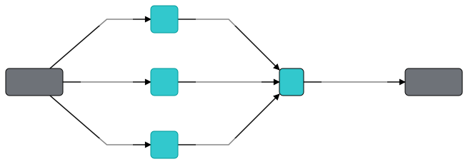

## Parallelization in Jina

##### Learn how Jina handles parallelization of data processing

### Feature description and expected outcome

Jina allows for parallelization of Peas and Pods. This generally leads to an increase in throughput, as the data is split across processes. 

### Before you start

You are expected to be familiar with the general concepts of Jina. You should also have experience with parallelism in other systems. Jina does follow the best practices and designs from other databases or search engines. However, Jina is primarily a *neural search engine*. This means some changes and adaptations were necessary. This chapter will explain these.

### Implementation

We will approach this from a top-down perspective. 

#### Inter-parallelism

`Pods` are the highest level of abstraction where we can have parallelism. This is achieved by using the `needs` parameter.

```python
f = (Flow().add(name='p1', needs='gateway')
           .add(name='p2', needs='gateway')
           .add(name='p3', needs='gateway')
           .needs(['p1','p2', 'p3'], name='r1').plot())
```

The plot of the above topology looks like this:



In the above, `p1`, `p2`, `p3` now subscribe to `gateway` and conduct their work in parallel. The last `.needs()` blocks all Pods until they finish their work.

#### Intra-parallelism

Peas are the next level at which we can configure parallelism. In this case, `Pod` receives the data (in its `HeadPea`) and then distributes it to its `Peas`. You can achieve this by using the `parallel` parameter:


```python
f = (Flow().add(name='p1', needs='gateway')
           .add(name='p2', needs='gateway')
           .add(name='p3', parallel=3)
           .needs(['p1','p3'], name='r1').plot())
```


#### State-less vs state-ful

Depending on the type of `Peas`, `parallel` means different things. In *state-less* `Peas` (`Crafters`, `Encoders` etc.), you *parallelize*, not *shard*. This means the data is not persisted, but it's only processed in a parallel manner. 

On the other hand, *state-ful* `Peas` (Indexers) will store the data across *shards*. This terminology is borrowed from other database systems

For more on sharding in other DB systems (with a focus on traditional SQL), see [here](https://subscription.packtpub.com/book/big_data_and_business_intelligence/9781849516723/1/ch01lvl1sec10/using-sharding-and-data-distribution)

For both of these, you need to set `parallel` to some number higher than `1`, and `polling` to `any`.

##### Index vs Query time Polling

We set `polling` to `any` in order to tell the `HeadPea` to spread the data across its inner `Peas`. This allows us to parallelize. You do this for the Flow you will use to index data. 

However, when querying, you need to make sure to use a Flow where the `Pods` are using `polling: all`. This ensures that the requests are seen by all the `Peas`, and that the respective `id` is found. If we use `polling: any` we risk that the key is not seen by the shard that has the data.

#### Scheduling

Jina offers two types of scheduling:

1. `round_robin` will assign tasks in circular order, without any prioritization. We assume all `Peas` have uniform processing power.

2. `load_balance` will assign tasks to the idle `Peas`.

These are configured via `scheduling`, on the `Pod` level.

### Limitations

At the moment Jina does not support sharding and replication of shards at the same time. We only support sharding (`Peas` of the `Pod` with their own parts of the data).
