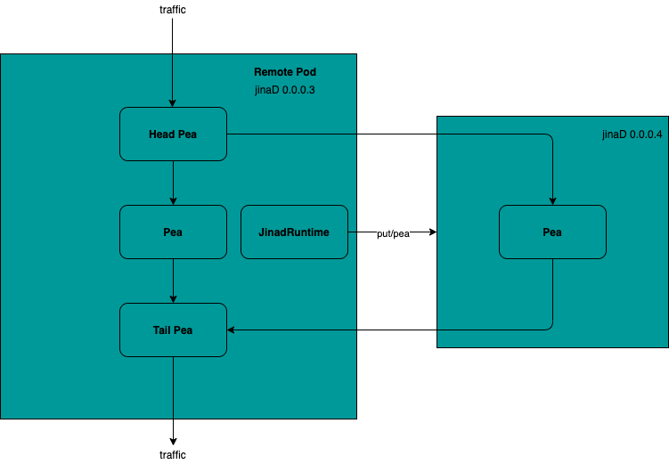

Development Guide: Peas and Pods in Jina
=========================================

.. meta::
   :description: Development Guide: Peas and Pods in Jina
   :keywords: Jina, pea, pod

.. note:: This guide assumes you have a basic understanding of Jina, if you haven't, please check out `Jina 101 <https://101.jina.ai>`_ first.
.. note:: This guide assumes you have a basic understanding of Parallelization inside Jina, if you haven't, please check out `Parallelization in Jina <../parallel>`_ first.

You might already learned from `Jina 101 <../101.rst>`_.
Jina :term:`Pea` wraps a :term:`Driver`, :term:`Executor` and lets it exchange data with other Peas.
Jina :term:`Pod` is a context manager for one or multiple Peas that have the same properties.
It coordinates Peas to improve efficiency and scaling.
Beyond that, a Pod adds further control, scheduling, and context management to its Peas.

In this tutorial, we dive deeper into Peas and Pods,
to help you gain in depth knowledge on the architecture and design principle of Peas and Pods in Jina.

.. contents:: Table of Contents
    :depth: 3

Pea and Pod Explained
^^^^^^^^^^^^^^^^^^^^^^^

Singleton Or Not?
------------------

In Jina, if a Pod only contains only one Pea, we call it a Singleton Pod.
If a user, define `parallel` as 1, then it will be considered as Singleton.
Otherwise, one Pod manages at least two Peas. e.g. `parallel` is at least 2.

In the first case, a Pod only manages a single Pea.
While in the second case, when user specifically defined a `parallel` value greater equal than 2,
Jina will add a :term:`HeadPea` and :term:`TailPea` to the same Pod.
HeadPea distribute traffic to different Peas inside the Pod,
TailPea collects the calculated result from the Peas inside the Pod.

Let's say we defined `parallel=3` inside a Pod,
then we have 5 Peas inside the Pod.
Traffic firstly arrive HeadPea, and the HeadPea distribute traffic two 3 peas in Parallel,
finally the result will be send to TailPea.

Jina offers parallelization at different levels, such as

1. Local Threads/Process with `BasePea`.
2. Inside container with `BasePea` inside `ContainerRuntime`.
3. Remotely with `RemotePeas` and `RemotePods` inside `JinadRuntime`.

Jina Daemon (JinaD) enables Jina to spin up and distribute Peas, Pods, Flows in any system.

Stateless vs Stateful Pea
---------------------------

In the previous section we mentioned `parallel`.
This parameter manages different Peas inside a Pod,
in a Stateless fashion.
Since a Pea is a wrap over Jina Executor.
Dependent on the type of the Executor, we consider a Pea is Stateless or Statefull.

If a Pea wraps an Encoder, Crafter, Segmenter, Ranker, Evaluator, Classifier, we consider it as Stateless.
Since this Pea will not persist data.
On the other hand, if a Pea wraps an Indexer, we consider it as Stateful.
Because we persist indexed result to our workspace.

We use `parallel` to manage the number of Stateless Peas inside a Pod.
We use `shards` to manage the number of Stateful Peas inside a Pod.

How Local Pea and Remote Pea interact with Pod
-----------------------------------------------

Let's first think about the case of a Singleton Pod running locally.
This Pod will only have 1 Pea inside, i.e. `parallel=1` or `shard=1`,
depends on the type of Executor it wraps.
The Pea inside the previous Pod will receive traffic from the last Pea,
process the data and send data to the next Pea.

When it comes to a Singleton Pod running remotely (i.e. runs with JinaD),
the main process will setup `JinadRuntime`,
the runtime is going to create remote Peas inside the remote machine.
The JinadRuntime take ownership of 2 tasks:

1. Parse args to JinaD to fire up a remote Pod with a single Pea using `put/pod` API endpoint.
2. Streaming logs from the remote Pod to the local Pod.

The remote Pea inside the remote Pod will process the data,
the result will be send to the next Pea.
In the next section we will talk about the most complex scenario: "distributed Remote Peas in Pod".

Distributed Remote Peas in Pod
-------------------------------

In this section, we talk about how multiple Peas (`parallel` or `shards` greater or equal to 2) runs inside a remote Pod.
First of all, the main process will setup `JinadRuntime`.
`JinadRuntime` create a new remote Pod inside the remote machine, with a HeaderPea,
a TailPea and `1` Pea inside the same machine,
the host of the Pea will stay the same as the Pod.

Take a look at the image below.
Imaging we defined `parallel=2` in our Flow/YAML configuration.
Since the current remote machine only has one IP address (`host=0.0.0.3`),
the Jina main process will setup another `JinadRuntime`,
and fire up another Pea inside the second host (`0.0.0.4`),
by calling `put/pea` API endpoint.

Then the HeadPea is going to distribute traffic to both Peas.
In the end, the TailPea collects data from Pea1 and Pea2,
and send data to the next Pea.

What's Next
^^^^^^^^^^^^

Thanks for your time & effort while reading this documentation.
If you want to know how we implement Peas and Pods,
please checkout the source code `here <https://github.com/jina-ai/jina/tree/master/jina/peapods>`_.

If you still have questions, feel free to `submit an issue <https://github.com/jina-ai/jina/issues>`_ or post a message in our `community slack channel <https://docs.jina.ai/chapters/CONTRIBUTING.html#join-us-on-slack>`_ .

