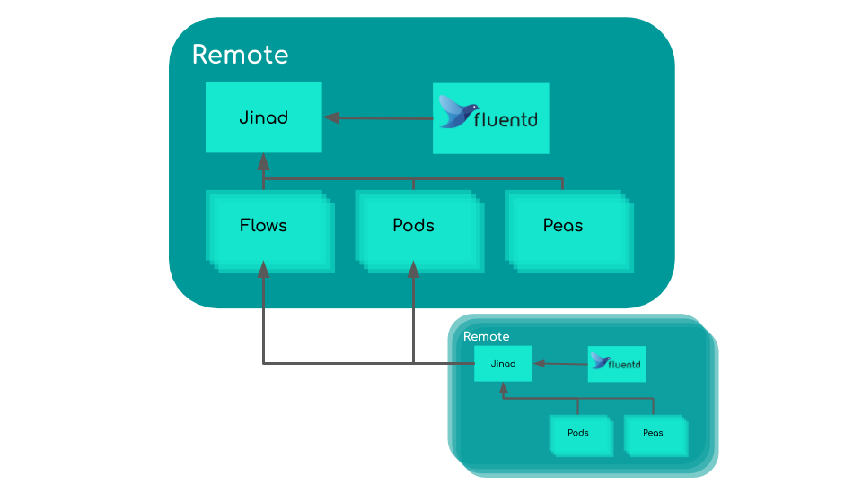

# Distributing Jina across multiple machines using JinaD

`JinaD` is a [daemon](https://en.wikipedia.org/wiki/Daemon_(computing)) for deploying and managing Jina Flows / Pods / Peas on a distributed system via a RESTful interface. It ships with [`fluentd`](https://github.com/fluent/fluentd) to collect & stream logs from a Flow.



## Installation

##### Docker Image (Recommended)

The simplest way to use `JinaD` is via Docker. You only need to have [Docker installed](https://docs.docker.com/install/).

We use the tag `latest-daemon` in the below command, which uses the latest release of `JinaD`. To use other versions, please refer to [versioning in Jina](https://github.com/jina-ai/jina/blob/master/RELEASE.md) and find all the available versions at [Docker Hub](https://hub.docker.com/repository/docker/jinaai/jina/tags?page=1&ordering=last_updated&name=daemon).

```bash
docker pull jinaai/jina:latest-daemon
```

##### Deploying AWS EC2 instance with jinad by [terraform](https://www.terraform.io/)

We extract a module [jinad-aws](https://registry.terraform.io/modules/jina-ai/jinad-aws/jina/latest) to simplify this work. 

With this terraform module we can:

- Custom the type and size of the root disk
- Deploy multiple AWS EC2 instance
- Execute extra command line
- Install `jinad`
- Manage `jinad` with `systemd`
- Add other python packages as required

##### PyPi package

> Note: `JinaD` is a part of the Jina and follows the same [installation instructions](https://docs.jina.ai/chapters/install/os/via-pip.html) and you only need to pick `[daemon]`

On Linux/Mac, simply run:

```bash
pip install "jina[daemon]"
```

##### Master branch

If you want to keep track of the master branch of our development repository:

```bash
pip install "git+https://github.com/jina-ai/jina.git#egg=jina[daemon]"
```

##### Local fork/clone

If you are a developer and want to test your changes on-the-fly:

```bash
git clone https://github.com/jina-ai/jina
cd jina && pip install -e ".[daemon]"
```

## Usage

##### Docker Image (Recommended)

We start a Docker container under the `host` mode so that it will connect all the ports to the host machine. `-d` option is to keep the container running in the background

```bash
docker run -d --network host jinaai/jina:latest-daemon
```

##### Native Python

> Note: Using Native Python doesn't ship fluentd, hence log streaming is not possible.

```bash
jinad
```

#### Prerequisites

- Start `JinaD` on a remote machine (say `1.2.3.4`)
- JinaD listens on port `8000` by default.
- To change the port number, run `jinad --port-expose <your-port>`
- Make sure `1.2.3.4:<your-port>` is publicly accessible.
- `http://1.2.3.4:<your-port>/` should return `{}` if JinaD is accessible.


### [Remote Pods with JinaD](remote-pods.md)

### [Remote Flows with JinaD](remote-flows.md)
