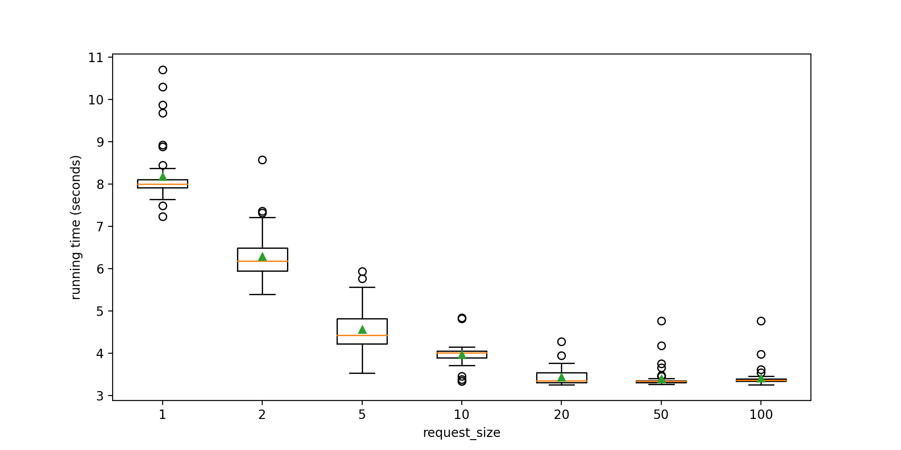

=================
Request Size
=================

``request_size`` is the parameter that we could set for the Flow.
It defines the number of ``Documents`` a single ``Request`` will contain,
so ``Peas`` will receive requests containing this amount of ``Documents`` according to different
scheduling policies.

.. contents:: Table of Contents
    :depth: 2

Request Size
------------
Jina defines the ``request_size`` as the parameter at client side. By setting the ``request_size`` in Flow's API
we could define the number of ``Documents`` contained in every ``Request``.

Batch Size
------------
Batch size, commonly used in machine learning, often refers to the number of data that we feed into
the model in one iteration.

In Jina, ``batch_size`` is used at ``Driver`` and ``Executor`` level. Where
we align the usage of machine learning terms for ``batch_size``.

Before you start
------------------
Make sure you intall latest version of Jina on your local machine.

.. highlight:: bash
.. code-block:: bash

    pip install -U jina

Implementation
--------------------
In order to have a better understanding of the influence of ``request_size`` and how it is used, let's take the following
codes as example.

We first import the necessary modules.

.. highlight:: python
.. code-block:: python

    import time
    from typing import Iterator

    import numpy as np
    from jina import Document
    from jina.executors.crafters import BaseCrafter
    from jina.flow import Flow

Then we define a  ``SimpleCrafter`` which will just forward the data.

.. highlight:: python
.. code-block:: python

    class SimpleCrafter(BaseCrafter):
        def craft(self, id, *args, **kwargs):
            return {'id': id}

For this example, we will index 100 documents and use 10 parallel ``Crafters``. The ``request_size``
is set as 20. So the 100 ``Documents`` will be divided into 5 parts and each ``Request`` contains 20 ``Documents``.

.. highlight:: python
.. code-block:: python

    def main():

        request_size=20
        start_time = time.time()
        f = Flow(runtime='process').add(
            name='simple_crafter',
            uses='SimpleCrafter',
            parallel=10)
        with f:
            f.index_ndarray(np.random.random([100, 10]), request_size=request_size)
        end_time = time.time()
        seconds_elapsed = end_time - start_time
        print(seconds_elapsed)

    if __name__ == '__main__':
        main()

Choose different request size
--------------------
Different setting of ``request_size`` may influence the running performance.
A higher value means large size data will be fed into the ``Pea`` and will demand more memory.
A lower value will decrease the cost of memory but may increase the running time since we need to send more ``requests``.

An simple extension of the above example generate a box plot showing the relationship between ``request_size`` and running time
when we have 100 number of ``Documents`` to be indexed.
which may help you to get more insights on choosing the ``request_size``.

