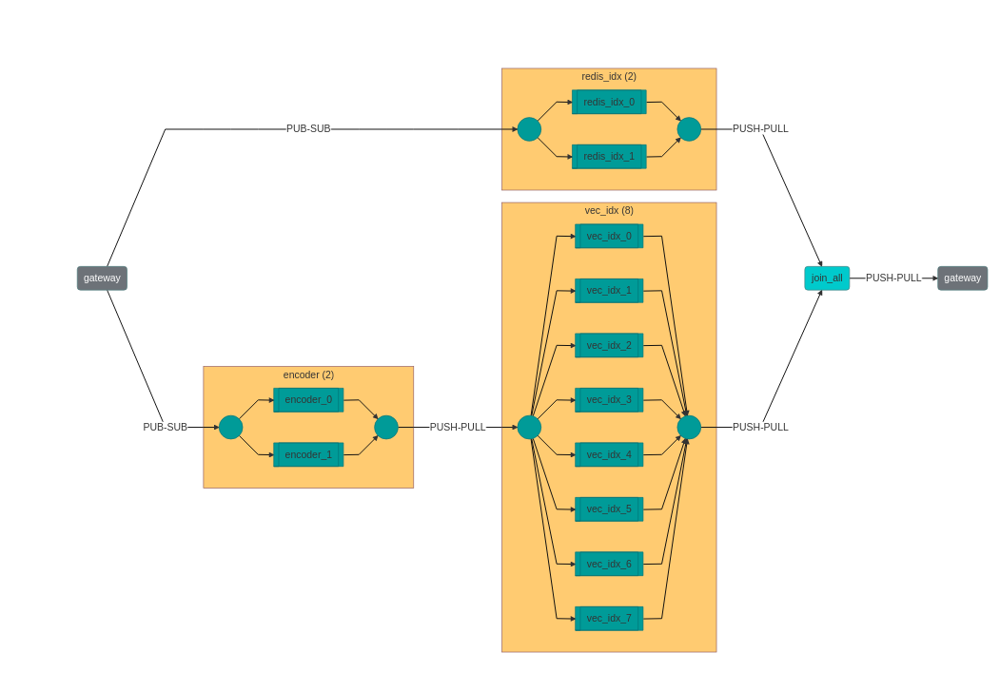
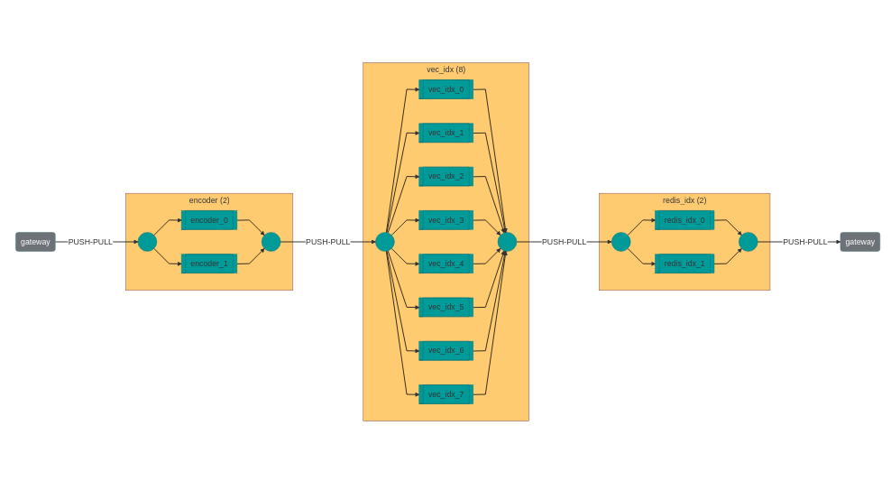
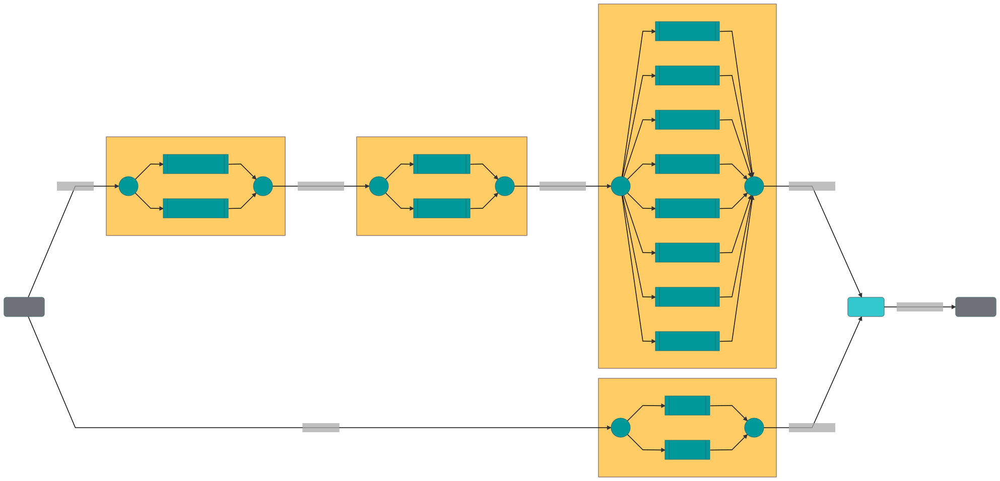
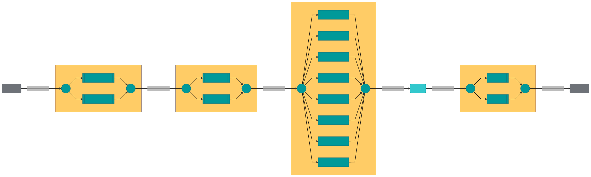

# Jina Cloud Benchmark & Deployment

#### Purpose: Showcase how Jina scales and how you can deploy to AWS

---

#### Table of Contents

- [Infrastructure](#infrastructure)
- [Datasets](#datasets)
  * [Image search](#image-search)
  * [Text search](#text-search)
- [Configuration](#configuration)
  * [Sharding and scheduling parameters](#sharding-and-scheduling-parameters)
  * [Functional/Indexers parameter](#functional-indexers-parameter)
  * [Client](#client)
- [Experiments](#experiments)
  * [Experiment 1 - Redis](#experiment-1---redis)
    + [Results](#results)
  * [Experiment 2 - BinaryPbIndexer](#experiment-2---binarypbindexer)
    + [Results](#results-1)
- [Test it yourself](#test-it-yourself)

## Infrastructure

This example benchmark prioritizes a real-world scenario, where a user hosts Jina in the cloud. We use six machines in AWS, of instace size `c5.2xlarge` (8 vCPUs, 16GB RAM). We also add 100GB gp2 ssd. For the Vector Indexer machine we increased RAM to 32 GB.

The instances are split as follows:

- **Client**: from this machine we create the Flows and issue the client requests (indexing and querying)
- **Flow**: this machine hosts the `Gateway` to the `Flow`
- **Encoder**: this machine processes the raw data (text or image) with the respective `Encoders`
- **Indexer**: this machine hosts the `Indexers`
- **Ranker**: this machine hosts the `Redis` servers and the `Rankers`

## Datasets

To run these tests, we prepared two scenarios: text and image search. These are the most common use cases for neural search. 

Note that in these tests, the quality of the results is not assessed, and therefore only the amount of returned matches is validated.

### Image search

The first scenario simulates an image search application. Images are randomly generated and indexed using a Flow with this topology:



We use the `mobilenet_v2` `Encoder` with the `ImageTorchEncoder`.

At query time, the Flow looks like this:



In the image search scenario, there is no `Segmentation` and ranking. The results are returned according to the `distance` in embedding space returned by the `VectorIndexers`. 

### Text search

The text search topology is similar to the one above, but with a `Segmenter` (`Sentencizer`) and a `Ranker` (`SimpleAggregateRanker`). This means we are indexing on the chunk level of a `Document`. 

The full indexing Flow can be seen below:



The full search Flow can be seen below:



## Configuration

The configuration parameters of this experiment can be found in the `.env` file, whose values are set as environment variables and changed in the `flow` and `pod` yamls.

The parameters are organized in 4 groups:

- Infrastructure parameters: Configure what the different machines are.
- Sharding Parameters: Configure the parallelization and sharding of different components
- Functional/Indexers parameters: Configure the functional parameters that can affect the performance of the search
- Client parameters: Configure how the client connects to the Flow

### Sharding and scheduling parameters

Jina allows for parallelization of data processing. You can read an overview of these options [here](https://docs.jina.ai/chapters/parallel/index.html). We use these to parallelize the various `Pods`. On the same topic, we also configure the `scheduling` strategy.

### Functional/Indexers parameter

As part of the benchmark, we also compare the performance of the `NumpyIndexer` with the advanced indexers, based on `Annoy` and `Faiss`. We also provide specific arguments to these: `num_tress` for `Annoy`; `index_key` for `Faiss`.

### Client  

In order to simulate a real-world scenarios, we also test using multiple concurrent clients. This is achieved using the Python `multiprocessing` library.

In order to stress-test the system, we also issue index and query requests for several hours in a row. Each request contains a specific number of `Documents`, split across requests of the same `request_size`.

The client also sets the `TOP_K` parameter. This limits the number of matches returned by the Flow. This also affects performance.

## Experiments

**NOTE** For now we only provide results for the `image` dataset. The `text` dataset will work too, if you want to test that.

For computing an estimated throughput we used the following configuration:

- Encoder: `parallel: 2`
- Vector Indexer: `shards: 8`
- key-value Indexer: `parallel: 2`
- scheduling: `load_balance`

See full environment configuration (the `.env` file):

<details>
  <summary>Click to expand</summary>
  
```dotenv
##Infrastructure parameters
JINA_ENCODER_HOST=encoder
JINA_RANKER_HOST=ranker
JINA_REDIS_INDEXER_HOST=ranker
JINA_VEC_INDEXER_HOST=vector

##Flow parameters
FLOW_HOST=flow_host
FLOW_PORT=8000

##Sharding/Performance parameters
JINA_SHARDS_ENCODER=2
JINA_SHARDS_INDEXERS=8
JINA_SHARDS_REDIS=2
OMP_NUM_THREADS=1
SCHEDULING=load_balance

##Functional/Indexers parameters
JINA_ENCODER_DRIVER_BATCHING=16
JINA_DISTANCE_REVERSE=False
JINA_FAISS_IMAGE=docker://jinahub/pod.indexer.faissindexer:0.0.15-0.9.33
JINA_ANNOY_IMAGE=docker://jinahub/pod.indexer.annoyindexer:0.0.16-0.9.33
JINA_FAISS_INDEX_KEY='IVF50,Flat'
JINA_ANNOY_NUM_TREES=100
JINA_ANNOY_SEARCH_K=-1

##Client/run parameters
TOP_K=50
#Number of documents a client will try to index at every connection
DOCS_INDEX=1000
#Number of documents a client will try to query at every connection
DOCS_QUERY=1000
PYTHON_EXEC=python3
DATASET=image
#Number of seconds for which clients will try to index documents. (The time is checked after each cycle of indexing `DOCS_INDEX`)
TIME_LOAD_INDEX=18000
#Number of seconds for which clients will try to query documents. (The time is checked after each cycle of indexing `DOCS_QUERY`)
TIME_LOAD_QUERY=3600
#Number of documents every request will contain
REQ_SIZE=50
#Number of concurrent clients indexing
CONCURRENCY_INDEX=5
#Number of concurrent clients querying
CONCURRENCY_QUERY=1
SLEEP_TIME=10

```
</details>

We provide two experiments, depending on the key-value store we employ.

### Experiment 1 - Redis

In this example we use [redis](https://redis.io/) as a key-value store.

#### Results

<table>
<thead>
  <tr>
    <th>Operation</th>
    <th>Vector Indexer</th>
    <th>KV Indexer</th>
    <th>Time (h)</th>
    <th>Documents</th>
    <th>QPS</th>
  </tr>
</thead>
<tbody>
  <tr>
    <td>Index</td>
    <td>NumpyIndexer</td>
    <td>Redis</td>
    <td>5</td>
    <td>1448000</td>
    <td>80.22</td>
  </tr>
  <tr>
    <td>Query</td>
    <td>Faiss (index_key='IVF50,Flat')</td>
    <td>Redis</td>
    <td>1</td>
    <td>22000</td>
    <td>5.89</td>
  </tr>
  <tr>
    <td>Query</td>
    <td>Annoy (trees=100, k=-1)</td>
    <td>Redis</td>
    <td>1</td>
    <td>23000</td>
    <td>6.14</td>
  </tr>
  <tr>
    <td>Query</td>
    <td>NumpyIndexer</td>
    <td>Redis</td>
    <td>1</td>
    <td>8000</td>
    <td>2.07</td>
  </tr>
</tbody>
</table>

### Experiment 2 - BinaryPbIndexer

In this example we use the `BinaryPbIndexer` as a key-value store, instead of `redis`.

#### Results

<table>
<thead>
  <tr>
    <th>Operation</th>
    <th>Vector Indexer</th>
    <th>KV Indexer</th>
    <th>Time (h)</th>
    <th>Documents</th>
    <th>QPS</th>
  </tr>
</thead>
<tbody>
  <tr>
    <td>Index</td>
    <td>NumpyIndexer</td>
    <td>BinaryPb</td>
    <td>5</td>
    <td>1283000</td>
    <td>71.05</td>
  </tr>
  <tr>
    <td>Query</td>
    <td>Faiss (index_key='IVF50,Flat')</td>
    <td>BinaryPb</td>
    <td>1</td>
    <td>108000</td>
    <td>29.77</td>
  </tr>
  <tr>
    <td>Query</td>
    <td>Annoy (trees=100, k=-1)</td>
    <td>BinaryPb</td>
    <td>1</td>
    <td>113000</td>
    <td>31.12</td>
  </tr>
  <tr>
    <td>Query</td>
    <td>NumpyIndexer</td>
    <td>BinaryPb</td>
    <td>1</td>
    <td>9000</td>
    <td>2.36</td>
  </tr>
</tbody>
</table>

## Test it yourself

To reproduce these benchmarks, follow this [guide](./instructions.md)
