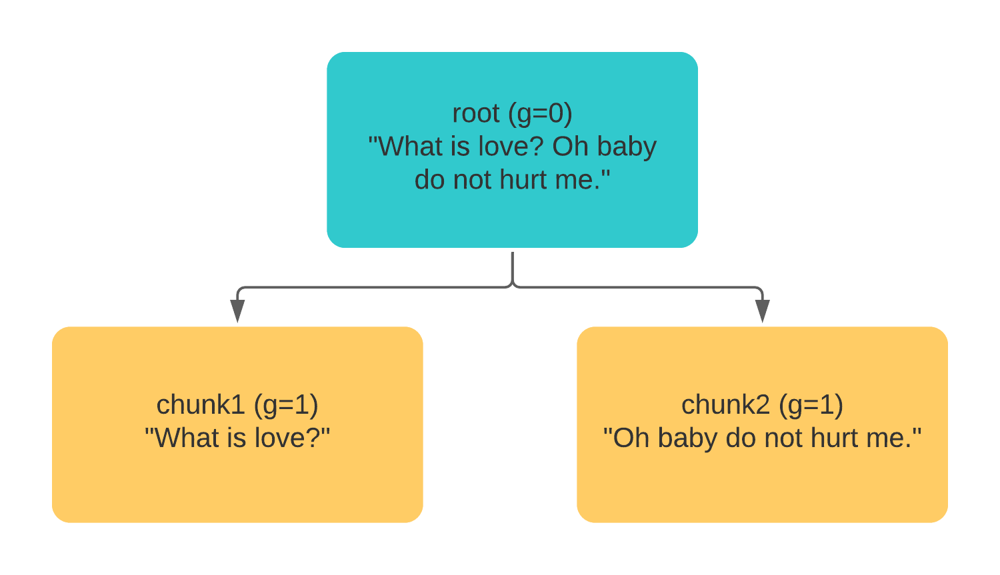
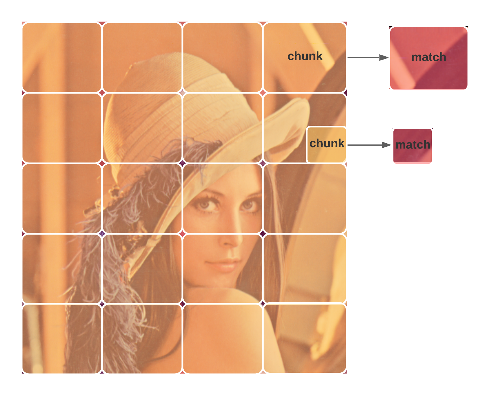
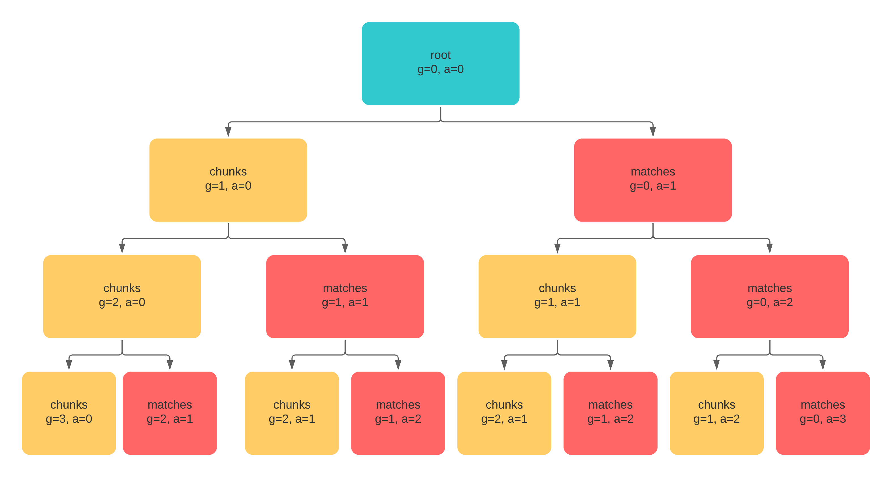
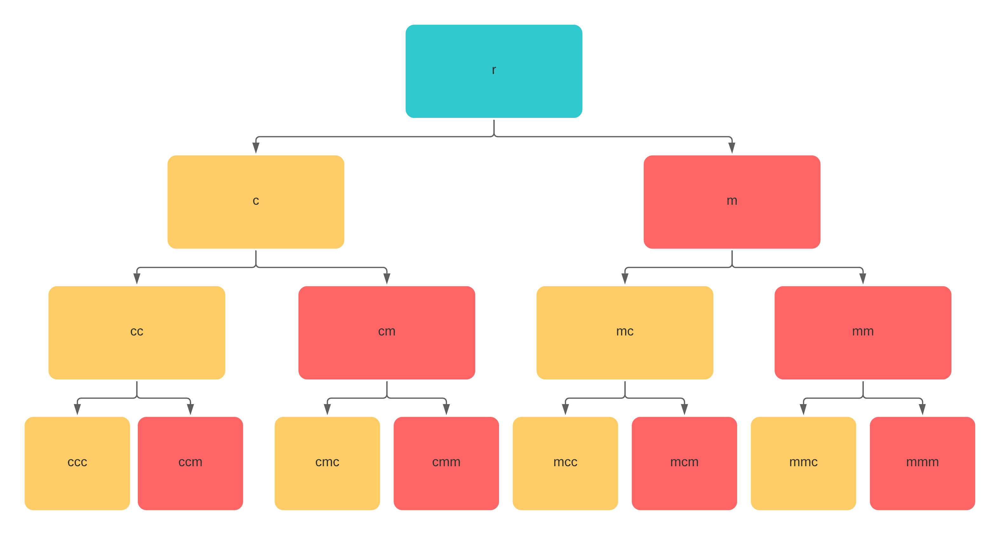

# Understand Jina Recursive Document Representation

In Jina, each Document is represented as a recursive representation (tree).

A rooted recursive representation has a root node and every node has X children.
In Jina, the root node is the document itself, while the *left* & *right* children are referred to as *chunks* and *matches* respectively.


The above image illustrates a basic document structure: A document (root node) and the two possible child nodes: *chunks* and *matches*.
chunks are a sequence of documents which is attached to the root document with a higher `granularity` degree. `matches` is a sequence of documents which are semantically related to the root document.
We'll dive into these concepts in this chapter:

- [Chunks](#chunks)
- [Matches](#matches)
- [Let's go deeper: Recursive Document Representation](#lets-go-deeper-recursive-document-representation)
- [Document Traversal with traversal paths](#document-traversal-with-traversal-paths)


## Chunks

Each Jina Document (potentially) consists of a list of chunks. A `chunk` is a small semantic unit of a Document, like a sentence or a 64x64 pixel image patch.

Think about these use cases: you want to search a document at a specific `granularity` level, e.g. a sentence or a paragraph.
Or your query consists of multiple modalities, such as a piece of text together with an image.
`chunk` makes it feasible!

In Jina [primitive data types](https://hanxiao.io/2020/11/22/Primitive-Data-Types-in-Neural-Search-System/), `chunk` is defined as a `property` of a Document:

```python
from jina import Document

with Document() as root:
    root.text = 'What is love? Oh baby do not hurt me.'
# Initialised a document as root with 0 chunks.
print(len(root.chunks))
>>> 0
# Initialise two documents and add as chunks to root.
with Document() as chunk1:
    chunk1.text = 'What is love?'
    root.chunks.add(chunk1)
with Document() as chunk2:
    chunk1.text = 'Oh baby do not hurt me.'
    root.chunks.add(chunk2)
# Now the document has 2 chunks
print(len(root.chunks))
>>> 2
```

What happened by adding `chunk` to `root`?

```python
print(root.granularity)
>>> 0
print(root.chunks[0].granularity)
>>> 1
root.id == root.chunks[0].parent_id
>>> True
```

This can be seen in the image below:



The code sample and graph above demonstrates the basic idea of a `chunk` in a Document.
In the beginning, we initialized a Document with `granularity=0` (by default).
We then initialized two chunks and add them to the `root` document.
Two things happened when adding the `chunk` to `root`:

1. The granularity of the chunk has been increased by 1 (default 0).
2. The `chunk` has been referenced to its parent: `root`.

This allows Jina (and you) to query chunks and reference back to its root document at any `granularity` level.

## Matches

In a neural search system (and traditional retrieval system), matches are the expected documents returned from the system given the user query.
In Jina, `matches` could happen at the `root` level or any `chunk` level.

To fully understand the concept of `matches`, we introduce a new term, named `adjacency` (short for `a` in the diagram), which reflects the level of the document it is connected to.

**NOTE: granularity and adjacency apply to both chunks and matches.**

```python
from jina import Document

with Document() as root:
    root.text = 'What is love? Oh baby do not hurt me.'
print(root.adjacency)
>>> 0
# Initialise two documents and add as chunks to root.
with Document() as chunk1:
    chunk1.text = 'What is love?'
    root.chunks.add(chunk1)
with Document() as chunk2:
    chunk1.text = 'Oh baby do not hurt me.'
    root.chunks.add(chunk2)
# Add a match document.
with Document() as match:
    # a match document semantically related to our root
    match.text = 'What is love? Oh please do not hurt me.'
    root.matches.add(match)
print(len(root.matches))
>>> 1
print(root.matches[0].granularity)
>>> 0
print(root.matches[0].adjacency)
>>> 1

```


In the code snippet and diagram above, we initialized a Document as `root` with the text: *What is love? Oh, baby do not hurt me.*.
And a Document with text *What is love? Oh please do not hurt me* was added as a match to the `root`.
The matched document `match` is a document without any parents, so it stays at the same level as `root` with a granularity value of 0.
Meanwhile, since `match` is the retrieved result from `root`, so the `adjacency` increased to 1.

By default, the `root` node has an `adjacency` of 0, and the value increases by 1 when it hits a `match`.

## Let's go deeper: Recursive Document Representation

Till now, we've introduced chunks and `matches` **with a depth of 1**.
While in a real-world scenario, things could be much more complicated than this.
For instance, a `chunk` could be further divided into small chunks, and a chunk at any level might have it's own `matches` at that level.


Jina has defined a recursive structure with **arbitrary width and depth** instead of a trivial bi-level structure.
Roughly speaking, chunks can have the next level chunks and the same level matches; and so do matches.
This could go on and on. The following figure illustrates this structure [Ref: New Features in Jina v0.5 You Should Know About](https://hanxiao.io/2020/08/28/What-s-New-in-Jina-v0-5/).



This recursive structure provides Jina the flexibility to cover any complex use case that may require search at different semantic units.
Besides, the recursive structure enables Jina rankers to accumulate scores from lower granularities to upper granularities, such as `Chunk2DocRankers`.
For example, in NLP a long document is composed of semantic chapters; each chapter consists of multiple paragraphs, which can be further segmented into sentences.
In CV, a video is composed of one or more scenes, including one or more shots (i.e. a sequence of frames taken by a single camera over a continuous period of time).
Each shot includes one or more frames. Such hierarchical structures can be very well represented with the recursive representation.

If we look from a tree view (with a depth of 3):



## Document Traversal with traversal paths

As you already learned from [Jina 101](https://101.jina.ai), you needs to apply transformation (i.e. a `callback`) on a different level of documents.
Given the tree structure, how could we achieve that?
The answer is `traversal`.

Jina has defined a method called `traversal` within the class of Document, which looks like this:

```python
def traverse(self, traversal_path: str, callback_fn: Callable, *args, **kwargs) -> None
    """Traversal apply `:meth:callback_fn` on the recursive tree representation."""
    ...
```

This allows you to apply `callback_fn` based on `traversal_path`.
The `traversal_path` is defined as below:



With these pre-defined node names, you're able to apply any callbacks (defined as `_apply_all` in the `driver`) to a specific node.
In the below YAML configuration, the `VectorSearchDriver` was applied to node `c`, `KVSearchDriver` was applied to node `cm` (matches of chunks).

```yaml
!CompoundIndexer
...
requests:
  on:
    SearchRequest:
      - !VectorSearchDriver
        with:
          traversal_path: ['c']
      - !KVSearchDriver
        with:
          traversal_path: ['cm']
```
