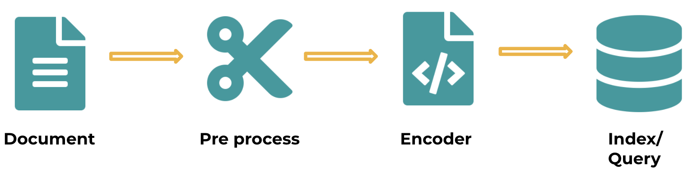

==================================
Tutorial 1
==================================

.. contents:: Table of Contents
    :depth: 3

We will use the `hello world chatbot <https://github.com/jina-ai/jina#run-quick-demo>`_ for this tutorial. You can find the complete code `here <https://github.com/jina-ai/jina/tree/master/jina/helloworld/chatbot>`_ and we will go step by step.

At the end of this tutorial, you will have your own chatbot. You will use text as an input and get a text result as output.
For this example, we will use a `covid dataset <https://www.kaggle.com/xhlulu/covidqa>`_.
You will understand how every part of this example works and how you can create new apps with different datasets on your own.

Set-up & overview
----------------------------------

We recommend creating a `new python virtual environment <https://docs.python.org/3/tutorial/venv.html>`_, to have a clean install of Jina and prevent dependency clashing.

We can start by installing Jina:

  .. code-block:: python

    pip install jina

For more information on installing Jina, refer to this `page <https://docs.jina.ai/chapters/install/os/via-pip>`_.

And we need the following dependencies:

  .. code-block:: python

    pip install click==7.1.2
    pip install transformers==4.1.1
    pip install torch==1.7.1

Once you have Jina and the dependencies installed, let's get a broad overview of the process we'll follow:

If you see the image, at the beginning of this flow process, you have your data, and this can be any type:

* Text
* Images
* Audio
* Video
* Or any other type

In this case, we are using text, but it can be whatever data type you want.

Once we have our data, as usual in machine learning, you'll probably need to pre-process that data. To keep this as simple as possible for this first tutorial, we won't need to do any pre-processing. But remember that this is a possibility for another use case.
Once that is ready, we can encode our data into vectors and finally store those vectors, so they are ready for indexing and querying.

Tutorial
---------

Define data and work directories
++++++++++++++++++++++++++++++++++++

We can start creating an empty folder, I'll call mine `tutorial` and that's the name you'll see through the tutorial but feel free to use whatever you wish.

We will display our results in our browser, so download the `static` folder from `here <https://github.com/jina-ai/jina/tree/master/jina/helloworld/chatbot/static>`_, and paste it into your `tutorial` folder. This is only the CSS and HTML files to render our results. We will use a dataset in a .csv format. I'll use the `COVID <https://www.kaggle.com/xhlulu/covidqa>`_ dataset from Kaggle. You don't need to download this by hand, we'll do it later in our app.

Create a Flow
++++++++++++++++++++++++++++++++++++

The very first concept you'll see in Jina is a `Flow`. You can see `here <https://github.com/jina-ai/jina/blob/master/.github/2.0/cookbooks/Flow.md>`_ a more formal introduction of what it is, but for now, think of the `Flow` as a manager in Jina, it takes care of the all the tasks that will run on your application and each `Flow` object will take care of one real-world task.

To create a `Flow` you only need to import it from Jina.
So open your favorite IDE and let's start writing our code:

.. code-block:: python

    from jina import Flow
    flow = Flow()

But this is an empty `Flow`, since we want to encode our data and then index it, we need to add elements to it. And what we add to a `Flow` are always `Executors` we will talk about them more formally later. But think of them as the elements you will need to do all the processing you want.

Add elements to a Flow
++++++++++++++++++++++++++++++++++++

To add elements to your Flow you just need to use the `add` keyword. You can add as many pods as you wish.

.. code-block:: python

    from jina import Flow

    flow = Flow().add().add()

And for our example, we need to add two `Executors`:

1. A transformer (to encode our data)
2. An indexer

So add the following to our code:

.. code-block:: python

    from jina import Flow
    flow = (
            Flow()
            .add(uses=MyTransformer)
            .add(uses=MyIndexer)
        )

Right now we haven't defined `MyTransformer` or `MyIndexer`, let's create some dummy `Executors` so we can try our app. These will not be our final `Executors` but let's create something basic to learn first.

Create dummy Executors
++++++++++++++++++++++++++++++++++++

Now we have a Flow with two `Executors`. Write the following in your code:

.. code-block:: python

    from jina import Jina, Executor

    class MyTransformer(Executor):
        def foo(self, **kwargs):
            print(f'foo is doing cool stuff: {kwargs}')

    class MyIndexer(Executor):
        def bar(self, **kwargs):
            print(f'bar is doing cool stuff: {kwargs}')

We will have more complex `Executors` later, for now our two `Executors` are only printing a line.

It's been a lot of information so far, so let's run our app to see what happens.

.. image:: res/executors_print.png
   :width: 600

If you run the code you should see something similar to this. Somewhere in the output, you should see the messages we defined in our Executors, along with their information.

So we have our `Flow` ready with two `Executors`. So far it's a simple `Flow` but it is still useful to visualize it to make sure it's what we want.

Visualize a Flow
++++++++++++++++++++++++++++++

By now, your code should look like this:

.. code-block:: python
    from jina import Flow, Document

    class MyTransformer(Executor):
        def foo(self, **kwargs):
            print(f'foo is doing cool stuff: {kwargs}')

    class MyIndexer(Executor):
        def bar(self, **kwargs):
            print(f'bar is doing cool stuff: {kwargs}')

    flow = (
            Flow()
            .add(uses=MyTransformer)
            .add(uses=MyIndexer)
        )

If you want to visualize your Flow you can do that with `plot`. So add the `.plot` function at the end of your `Flow`

.. code-block:: python

    from jina import Flow

    flow = (
            Flow()
            .add(uses=MyTransformer)
            .add(uses=MyIndexer)
            .plot('our_flow.svg')
        )

Let's run the code we have so far. If you try it, not much will happen since we are not indexing anything yet, but you will see the new file `our_flow.svg` created on your working folder, and if you open it you would see this:

You can see a `Flow` with two `Executors`, but what if you have many `Executors`? this can quickly become very messy, so it is better to name the `Executors` with `name='CoolName`. So in our example, we use:

.. code-block:: python

    from jina import Flow

    flow = (
            Flow()
            .add(name='MyTransformer', uses=MyTransformer)
            .add(name='MyIndexer', uses=MyIndexer)
            .plot('our_flow.svg')
        )

Now if you run this, you should have a `Flow` that is more explicit:

.. image:: res/plot_flow2.png
   :width: 600

Use a Flow
++++++++++++++++++++++++++++++++++++

Ok, we have our `Flow` created and visualized. Let's put it to use now. The correct way to use a `Flow` is to open it as a context manager, using the `with` keyword:

.. code-block:: python

    with flow:
        ...

Before we use it in our example, let's recap a bit of what we have seen:

.. code-block:: python

    from jina import Flow
    flow = Flow()          # Create Flow

    flow.add().add()       # Add elements to Flow
    flow.plot()            # Visualize a Flow

    with flow:             # Use Flow as a context manager
        flow.index()

In our example, we have a `Flow` with two `Executors` (`MyTransformer` and `MyIndexer`) and we want to use our `Flow` to index our data. But in this case, our data is a `csv` file. We need to open it first.

.. code-block:: python

    with flow, open('our_dataset.csv') as fp:
            flow.index()

Now we have our `Flow` ready, we can start to index. But we can't just pass the dataset in the original format to our `Flow`. We need to create a `Document` with the data we want to use.

To create a Document
++++++++++++++++++++++++++++++++++++
To create a `Document` in Jina, we do it like this:

.. code-block:: python

    from jina import Document
    doc = Document(content='hello, world!')

In our case, the content of our Document needs to be the dataset we want to use:

.. code-block:: python

    from jina import Document
    doc = Document.from_csv(fp, field_resolver={'question': 'text'})

So what happened there? We created a Document `doc`, and we use `from_csv` to load our dataset.
We use `field_resolver` to map the text from our dataset to the Document attributes.

Get our data
++++++++++++++++++++++++++++++++++++

We have everything ready to use our `Flow`, but so far we have been using dummy data. Let's download our dataset now. Copy and paste this snippet, we don't need to go into the details for this. What it does is to download the `covid dataset <https://www.kaggle.com/xhlulu/covidqa>`_.

.. code-block:: python

    def download_data(targets, download_proxy=None, task_name='download covid-dataset'):
    """
    Download data.

    :param targets: target path for data.
    :param download_proxy: download proxy (e.g. 'http', 'https')
    :param task_name: name of the task
    """
    opener = urllib.request.build_opener()
    opener.addheaders = [('User-agent', 'Mozilla/5.0')]
    if download_proxy:
        proxy = urllib.request.ProxyHandler(
            {'http': download_proxy, 'https': download_proxy}
        )
        opener.add_handler(proxy)
    urllib.request.install_opener(opener)
    with ProgressBar(task_name=task_name, batch_unit='') as t:
        for key, value in targets.items():
            if not os.path.exists(value['filename']):
                urllib.request.urlretrieve(
                    value['url'], value['filename'], reporthook=lambda *x: t.update_tick(0.01)
                )

Let's re-organize our code a little bit. First, we should import everything we need:

.. code-block:: python

    import os
    import urllib.request
    import webbrowser
    from pathlib import Path

    from jina import Flow, Executor
    from jina.logging import default_logger
    from jina.logging.profile import ProgressBar
    from jina.parsers.helloworld import set_hw_chatbot_parser
    from jina.types.document.generators import from_csv

Then we should have our `main`, a `download_data` function to get our data and a `tutorial` function for all the rest

.. code-block:: python

    def download_data(targets, download_proxy=None, task_name='download covid-dataset'):
        # This is exactly as the previous snippet we just saw

    def tutorial(args):
        # Here we will have everything for our tutorial

    if __name__ == '__main__':
        args = set_hw_chatbot_parser().parse_args()
        tutorial(args)

Now let's see our `tutorial` function with all the code we've done so far:

.. code-block:: python

    def tutorial(args):
        Path(args.workdir).mkdir(parents=True, exist_ok=True)

        class MyTransformer(Executor):
            def foo(self, **kwargs):
                print(f'foo is doing cool stuff: {kwargs}')

        class MyIndexer(Executor):
            def bar(self, **kwargs):
                print(f'bar is doing cool stuff: {kwargs}')

        targets = {
            'covid-csv': {
                'url': args.index_data_url,
                'filename': os.path.join(args.workdir, 'dataset.csv'),
            }
        }

        # download the data
        download_data(targets, args.download_proxy, task_name='download covid-dataset')

        flow = (
            Flow()
                .add(name='MyTransformer', uses=MyTransformer)
                .add(name='MyIndexer', uses=MyIndexer)
                .plot('test.svg')
        )

        with flow, open(targets['covid-csv']['filename']) as fp:
            flow.index(from_csv(fp, field_resolver={'question': 'text'}))

If you run this, it should finish without errors. You won't see much yet because we are not showing anything after we index. But you should see a new directory created with the downloaded dataset:

.. image:: res/downloaded_dataset.png
   :width: 600

To actually see something we need to specify how we will display it. For our tutorial we will do so in our browser. Add the following after indexing:

.. code-block:: python

        flow.use_rest_gateway(args.port_expose)

        url_html_path = 'file://' + os.path.abspath(
            os.path.join(
                os.path.dirname(os.path.realpath(__file__)), 'static/index.html'
            )
        )
        try:
            webbrowser.open(url_html_path, new=2)
        except:
            pass  # intentional pass, browser support isn't cross-platform
        finally:
            default_logger.success(
                f'You should see a demo page opened in your browser, '
                f'if not, you may open {url_html_path} manually'
            )

        if not args.unblock_query_flow:
            flow.block()

For more information on what the Flow is doing, specially in `f.use_rest_gateway(args.port_expose)` and `f.block()` check our `cookbook <https://github.com/jina-ai/jina/blob/master/.github/2.0/cookbooks/Flow.md>`_

Ok, so it seems that we have plenty of work done already. If you run this you will see a new tab open in your browser, and there you will have a text box ready for you to input some text. However, if you try to enter anything you won't get any results. This is because we are using dummy Executors. Our `MyTransformer` and `MyIndexer` aren't actually doing anything. So far they only print a line when they are called. So we need real `Executors`.

This has been already plenty of new information you've learned so far, so we won't go into `Executors` today. Instead you can copy-paste the ones we are using for `this example <https://github.com/jina-ai/jina/blob/master/jina/helloworld/chatbot/executors.py>`_. The important part to know is that all Executors' behavior is defined in executors.py`

To try the `Executors` from the Github repo, just add this before the `download_data` function:

.. code-block:: python

    if __name__ == '__main__':
        from executors import MyTransformer, MyIndexer
    else:
        from .executors import MyTransformer, MyIndexer

And remove the dummy executors we made.

And we are done! If you followed all the steps, now you should have something like this in your browser:

.. image:: res/results.png
   :width: 600

There are still a lot of concepts to learn. So stay tuned for our next tutorials.

If you have any issues following this tutorial, you can always get support from our [Slack community](https://slack.jina.ai/)

Community
----------------------------------

- [Slack channel](https://slack.jina.ai/) - a communication platform for developers to discuss Jina.
- [LinkedIn](https://www.linkedin.com/company/jinaai/) - get to know Jina AI as a company and find job opportunities.
- [Twitter](https://twitter.com/JinaAI_) - follow us and interact with us using hashtag `#JinaSearch`.
- [Company](https://jina.ai) - know more about our company, we are fully committed to open-source!

License
----------------------------------

Copyright (c) 2021 Jina AI Limited. All rights reserved.

Jina is licensed under the Apache License, Version 2.0. See [LICENSE](https://github.com/jina-ai/jina/blob/master/LICENSE) for the full license text.
