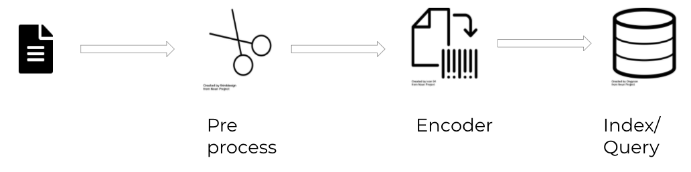
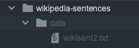

==================================
Tutorial 1
==================================

.. contents:: Table of Contents
    :depth: 2

What is Jina
----------------------------------

Tutorial
----------------------------------

At the end of this tutorial you will have your own search engine using text. You will use text as an input and get a matching text for that.
For this example we will use the `Kaggle Wikipedia Corpus <https://www.kaggle.com/mikeortman/wikipedia-sentences>`_
You will understand how every part of this example works and how you could create new apps with different datasets on your own. 

Set-up & Overview
----------------------------------

The first part is to install Jina.

  .. code-block:: python

    pip install jina

Annd we will also need the following dependencies:

  .. code-block:: python

    pip install click==7.1.2
    pip install transformers==4.1.1
    pip install torch==1.7.1

Once you have Jina installed let's take a broad overview on what we should do:

At the beginning of the flow, you have your data, this can be any type:

* Audio
* Image
* Video
* Text

In this case we are using text, so in the image you see text only. But it can be whatever type you want.

Once we have our data, as usual in Machine Learning, it's probable that you might need to pre-process that data. To keep this as simple as possible for this first tutorial, and since we are using the #TBD (dataset used TBD), we won't need to do any pre-processing. But just remember that this is a possibility for another use case.
Once that is ready, we can encode our data into vectors and finally store those vectors, so it is ready for indexing and then querying.

So what we need to do is:

1. Define data
2. Pre-process it (we won't need this for this example)
3. Encode data
4. Index / Query

As you can see, the last part can be Indexing or Querying, so it means we will need to do these steps twice, one for when we want to Index and one for we want to Search. So let's see each Flow in detail.

Index Flow
----------------------------------

1. Define data
+++++++++++++++

The first thing we need is to `download our data <https://www.kaggle.com/mikeortman/wikipedia-sentences>`_, extract it and store it in a `/data` folder. So you should have something like this:

2. Encode Data
+++++++++++++++

We have our data ready, what now? Well, we can't use our data directly from its original data type, text in this case. We need first to transform that data into vectors, and this way, it doesn't matter if we have image, video, text, 3D mesh or any other type. All of them will be transformed into vector embeddings so we can all treat them the same way.

Let's start to create our Index Flow so we can encode our data there.

To create a Flow you only need:

.. code-block:: python

    from jina import Flow
    f = Flow()

But this is an empty Flow, since we want to encode our data and then index it, we will need our Flow to have those 2 elements:

1. An transformer (to encode our data)
2. An indexer

.. code-block:: python

    from jina import Flow
    f = (
            Flow()
            .add(uses=MyTransformer)
            .add(uses=MyIndexer)
        )

Right now we haven't defined `MyTransformer` or `MyIndexer`, we will do that later. But for now you should understand that this is where you will use the command `add` to add any elements that you will need in your Flow. You can refer to our cookbook to see more details on how to create a `Flow <https://github.com/jina-ai/jina/blob/master/.github/2.0/cookbooks/Flow.md#minimum-working-example>`_

No we have our Flow ready, we can start to index. But we can't just pass the dataset that we have to our Flow, we need to crate a Document with the data that we want to use.
We can index our data now. For this need to create a Document and to create a Document we just need to import it from Jina:

.. code-block:: python

    from jina import Document
    d = Document(content='hello, world!')

But in our case, the content of our Document needs to be the dataset set we want to use, so we do it like this:

.. code-block:: python

    from jina import Document
    d = Document.from_csv(fp, field_resolver={'question': 'text'})

So what happened there? We created a Document `d`, and we use `from_csv` to load our dataset.
We use `field_resolver` to map the text from our dataset to the Document attributes.

By now you should have this:

.. code-block:: python
    from jina import Flow, Document

    f = (
            Flow()
            .add(uses=MyTransformer)
            .add(uses=MyIndexer)
        )

    with f, open('our_dataset.csv']) as fp:
        f.index(Document.from_csv(fp, field_resolver={'question': 'text'}))

6. Explain what Flow is and plot
7. Index and interpret output

Query Flow
----------------------------------
1. Get data
2. Create Document
3. Encode data
4. Query and interprete results. In terminal and Jina Box